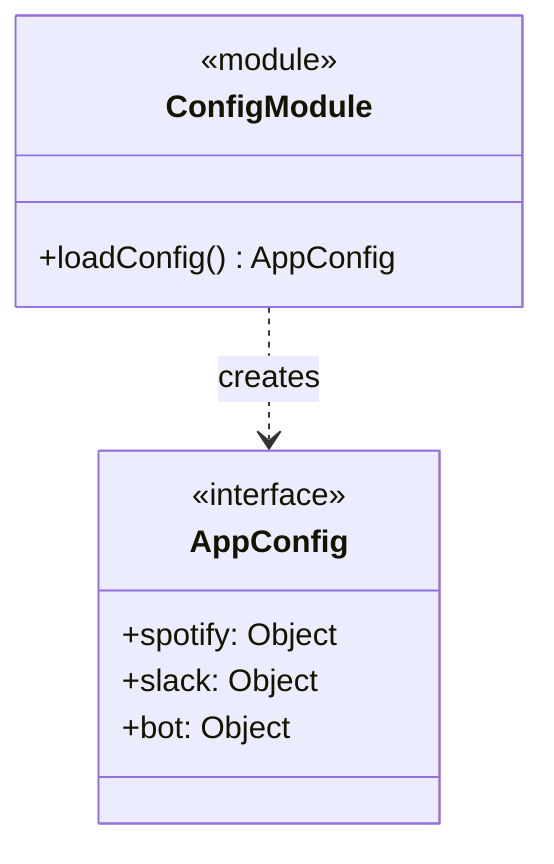

# Configuration

## Purpose and Functionality
The Configuration module loads, validates, and strongly types the environment variables. It parses the `.env` file via `dotenv` and ensures all required API keys and configuration settings are present before the application starts.

## Class Diagram

## Interactions
- **Global**: `loadConfig()` is invoked during application bootstrap, and the resulting `AppConfig` object is injected into almost every other service (`SpotifyService`, `SlackService`, `SyncService`) as a central source of truth for runtime configurations.
