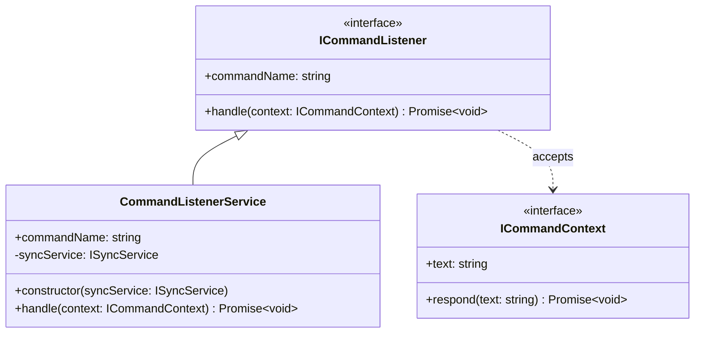

# Command Listener Service

## Purpose and Functionality
The Command Listener Service provides business logic to handle incoming Slack Slash Commands (e.g., `/spotifystatus`). It acts as a controller, mapping Slack UI actions to bot operations like starting or stopping the background synchronization polling.

## Class Diagram

## Interactions
- **SlackService**: The `SlackService` receives events from Slack and delegates the matching command execution to the `CommandListenerService`.
- **SyncService**: Interacts with the `ISyncService` to `start()` or `stop()` the background syncing loops when instructed by the user via slash command.
