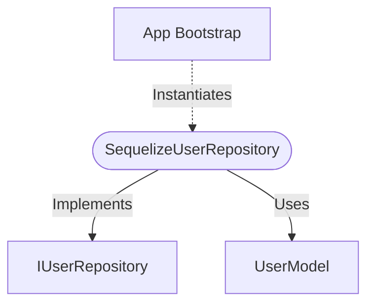

[**spotify-status-bot**](../../../../README.md)

***

[spotify-status-bot](../../../../README.md) / [db/repositories/UserRepository](../README.md) / SequelizeUserRepository

# Class: SequelizeUserRepository

Defined in: [src/db/repositories/UserRepository.ts:39](https://github.com/tehJimboJones/spotify-slack-status-sync/blob/1e46a35f98db5d61d3f91586400e86d860cce2c4/src/db/repositories/UserRepository.ts#L39)

Sequelize-based implementation of the User repository.

## Remarks

Implements the IUserRepository contract using Sequelize models to persist and retrieve User entities in a relational database.

### Relationships


## Example

```typescript
const userRepository = new SequelizeUserRepository();
```

## Implements

- [`IUserRepository`](../../../../services/user/types/interfaces/IUserRepository.md)

## Constructors

### Constructor

> **new SequelizeUserRepository**(): `SequelizeUserRepository`

#### Returns

`SequelizeUserRepository`

## Methods

### create()

> **create**(`user`): `Promise`\<[`User`](../../../../services/user/types/interfaces/User.md)\>

Defined in: [src/db/repositories/UserRepository.ts:63](https://github.com/tehJimboJones/spotify-slack-status-sync/blob/1e46a35f98db5d61d3f91586400e86d860cce2c4/src/db/repositories/UserRepository.ts#L63)

Helper method for tests/admin to create users since we removed create() from interface
to align with Phase 1 constraints.

#### Parameters

##### user

`Omit`\<[`User`](../../../../services/user/types/interfaces/User.md), `"id"`\>

#### Returns

`Promise`\<[`User`](../../../../services/user/types/interfaces/User.md)\>

#### Implementation of

[`IUserRepository`](../../../../services/user/types/interfaces/IUserRepository.md).[`create`](../../../../services/user/types/interfaces/IUserRepository.md#create)

***

### findAll()

> **findAll**(): `Promise`\<[`User`](../../../../services/user/types/interfaces/User.md)[]\>

Defined in: [src/db/repositories/UserRepository.ts:54](https://github.com/tehJimboJones/spotify-slack-status-sync/blob/1e46a35f98db5d61d3f91586400e86d860cce2c4/src/db/repositories/UserRepository.ts#L54)

#### Returns

`Promise`\<[`User`](../../../../services/user/types/interfaces/User.md)[]\>

#### Implementation of

[`IUserRepository`](../../../../services/user/types/interfaces/IUserRepository.md).[`findAll`](../../../../services/user/types/interfaces/IUserRepository.md#findall)

***

### findById()

> **findById**(`id`): `Promise`\<[`User`](../../../../services/user/types/interfaces/User.md) \| `null`\>

Defined in: [src/db/repositories/UserRepository.ts:40](https://github.com/tehJimboJones/spotify-slack-status-sync/blob/1e46a35f98db5d61d3f91586400e86d860cce2c4/src/db/repositories/UserRepository.ts#L40)

#### Parameters

##### id

`string`

#### Returns

`Promise`\<[`User`](../../../../services/user/types/interfaces/User.md) \| `null`\>

#### Implementation of

[`IUserRepository`](../../../../services/user/types/interfaces/IUserRepository.md).[`findById`](../../../../services/user/types/interfaces/IUserRepository.md#findbyid)

***

### findBySlackId()

> **findBySlackId**(`slackId`): `Promise`\<[`User`](../../../../services/user/types/interfaces/User.md) \| `null`\>

Defined in: [src/db/repositories/UserRepository.ts:45](https://github.com/tehJimboJones/spotify-slack-status-sync/blob/1e46a35f98db5d61d3f91586400e86d860cce2c4/src/db/repositories/UserRepository.ts#L45)

#### Parameters

##### slackId

`string`

#### Returns

`Promise`\<[`User`](../../../../services/user/types/interfaces/User.md) \| `null`\>

#### Implementation of

[`IUserRepository`](../../../../services/user/types/interfaces/IUserRepository.md).[`findBySlackId`](../../../../services/user/types/interfaces/IUserRepository.md#findbyslackid)

***

### update()

> **update**(`slackId`, `data`): `Promise`\<`void`\>

Defined in: [src/db/repositories/UserRepository.ts:50](https://github.com/tehJimboJones/spotify-slack-status-sync/blob/1e46a35f98db5d61d3f91586400e86d860cce2c4/src/db/repositories/UserRepository.ts#L50)

#### Parameters

##### slackId

`string`

##### data

`Partial`\<[`User`](../../../../services/user/types/interfaces/User.md)\>

#### Returns

`Promise`\<`void`\>

#### Implementation of

[`IUserRepository`](../../../../services/user/types/interfaces/IUserRepository.md).[`update`](../../../../services/user/types/interfaces/IUserRepository.md#update)
