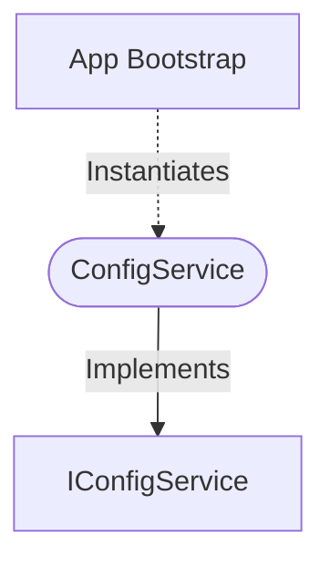

[**spotify-status-bot**](../../../../README.md)

***

[spotify-status-bot](../../../../README.md) / [services/config/config.service](../README.md) / ConfigService

# Class: ConfigService

Defined in: [src/services/config/config.service.ts:41](https://github.com/tehJimboJones/spotify-slack-status-sync/blob/1e46a35f98db5d61d3f91586400e86d860cce2c4/src/services/config/config.service.ts#L41)

Centralized configuration management service.

## Remarks

Parses, validates, and serves application configuration from environment variables, ensuring defaults and immutability.

### Relationships


## Example

```typescript
const configService = new ConfigService();
```

## Implements

- [`IConfigService`](../../types/interfaces/IConfigService.md)

## Constructors

### Constructor

> **new ConfigService**(): `ConfigService`

Defined in: [src/services/config/config.service.ts:44](https://github.com/tehJimboJones/spotify-slack-status-sync/blob/1e46a35f98db5d61d3f91586400e86d860cce2c4/src/services/config/config.service.ts#L44)

#### Returns

`ConfigService`

## Methods

### getBotConfig()

> **getBotConfig**(): `object`

Defined in: [src/services/config/config.service.ts:115](https://github.com/tehJimboJones/spotify-slack-status-sync/blob/1e46a35f98db5d61d3f91586400e86d860cce2c4/src/services/config/config.service.ts#L115)

#### Returns

`object`

##### baseUrl

> **baseUrl**: `string`

##### pausedEmoji

> **pausedEmoji**: `string`

##### pollIntervalMs

> **pollIntervalMs**: `number`

##### port

> **port**: `number`

##### statusEmoji

> **statusEmoji**: `string`

##### statusFormat

> **statusFormat**: `string`

#### Implementation of

[`IConfigService`](../../types/interfaces/IConfigService.md).[`getBotConfig`](../../types/interfaces/IConfigService.md#getbotconfig)

***

### getDbConfig()

> **getDbConfig**(): `object`

Defined in: [src/services/config/config.service.ts:119](https://github.com/tehJimboJones/spotify-slack-status-sync/blob/1e46a35f98db5d61d3f91586400e86d860cce2c4/src/services/config/config.service.ts#L119)

#### Returns

`object`

##### dialect

> **dialect**: `"mysql"` \| `"sqlite"`

##### host

> **host**: `string`

##### name

> **name**: `string`

##### pass

> **pass**: `string`

##### port

> **port**: `number`

##### storage?

> `optional` **storage?**: `string`

##### user

> **user**: `string`

#### Implementation of

[`IConfigService`](../../types/interfaces/IConfigService.md).[`getDbConfig`](../../types/interfaces/IConfigService.md#getdbconfig)

***

### getFullConfig()

> **getFullConfig**(): [`AppConfig`](../../types/interfaces/AppConfig.md)

Defined in: [src/services/config/config.service.ts:123](https://github.com/tehJimboJones/spotify-slack-status-sync/blob/1e46a35f98db5d61d3f91586400e86d860cce2c4/src/services/config/config.service.ts#L123)

#### Returns

[`AppConfig`](../../types/interfaces/AppConfig.md)

#### Implementation of

[`IConfigService`](../../types/interfaces/IConfigService.md).[`getFullConfig`](../../types/interfaces/IConfigService.md#getfullconfig)

***

### getSlackConfig()

> **getSlackConfig**(): `object`

Defined in: [src/services/config/config.service.ts:111](https://github.com/tehJimboJones/spotify-slack-status-sync/blob/1e46a35f98db5d61d3f91586400e86d860cce2c4/src/services/config/config.service.ts#L111)

#### Returns

`object`

##### appToken?

> `optional` **appToken?**: `string`

##### clientId

> **clientId**: `string`

##### clientSecret

> **clientSecret**: `string`

##### signingSecret

> **signingSecret**: `string`

##### userToken

> **userToken**: `string`

#### Implementation of

[`IConfigService`](../../types/interfaces/IConfigService.md).[`getSlackConfig`](../../types/interfaces/IConfigService.md#getslackconfig)

***

### getSpotifyConfig()

> **getSpotifyConfig**(): `object`

Defined in: [src/services/config/config.service.ts:107](https://github.com/tehJimboJones/spotify-slack-status-sync/blob/1e46a35f98db5d61d3f91586400e86d860cce2c4/src/services/config/config.service.ts#L107)

#### Returns

`object`

##### clientId

> **clientId**: `string`

##### clientSecret

> **clientSecret**: `string`

##### redirectUri

> **redirectUri**: `string`

##### refreshToken

> **refreshToken**: `string`

#### Implementation of

[`IConfigService`](../../types/interfaces/IConfigService.md).[`getSpotifyConfig`](../../types/interfaces/IConfigService.md#getspotifyconfig)
