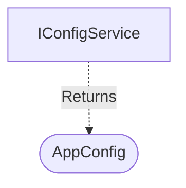

[**spotify-status-bot**](../../../../README.md)

***

[spotify-status-bot](../../../../README.md) / [services/config/types](../README.md) / AppConfig

# Interface: AppConfig

Defined in: [src/services/config/types.ts:35](https://github.com/tehJimboJones/spotify-slack-status-sync/blob/1e46a35f98db5d61d3f91586400e86d860cce2c4/src/services/config/types.ts#L35)

Structure of the unified application configuration.

## Remarks

Defines the strongly-typed schema for all environmental and runtime configuration parameters required by the application.

### Relationships


## Example

```typescript
const cfg: AppConfig = { port: 3000, slack: { ... } };
```

## Properties

### bot

> **bot**: `object`

Defined in: [src/services/config/types.ts:52](https://github.com/tehJimboJones/spotify-slack-status-sync/blob/1e46a35f98db5d61d3f91586400e86d860cce2c4/src/services/config/types.ts#L52)

Bot behavior configuration

#### baseUrl

> **baseUrl**: `string`

#### pausedEmoji

> **pausedEmoji**: `string`

#### pollIntervalMs

> **pollIntervalMs**: `number`

#### port

> **port**: `number`

#### statusEmoji

> **statusEmoji**: `string`

#### statusFormat

> **statusFormat**: `string`

***

### db

> **db**: `object`

Defined in: [src/services/config/types.ts:60](https://github.com/tehJimboJones/spotify-slack-status-sync/blob/1e46a35f98db5d61d3f91586400e86d860cce2c4/src/services/config/types.ts#L60)

#### dialect

> **dialect**: `"mysql"` \| `"sqlite"`

#### host

> **host**: `string`

#### name

> **name**: `string`

#### pass

> **pass**: `string`

#### port

> **port**: `number`

#### storage?

> `optional` **storage?**: `string`

#### user

> **user**: `string`

***

### slack

> **slack**: `object`

Defined in: [src/services/config/types.ts:44](https://github.com/tehJimboJones/spotify-slack-status-sync/blob/1e46a35f98db5d61d3f91586400e86d860cce2c4/src/services/config/types.ts#L44)

Slack API configuration credentials

#### appToken?

> `optional` **appToken?**: `string`

#### clientId

> **clientId**: `string`

#### clientSecret

> **clientSecret**: `string`

#### signingSecret

> **signingSecret**: `string`

#### userToken

> **userToken**: `string`

***

### spotify

> **spotify**: `object`

Defined in: [src/services/config/types.ts:37](https://github.com/tehJimboJones/spotify-slack-status-sync/blob/1e46a35f98db5d61d3f91586400e86d860cce2c4/src/services/config/types.ts#L37)

Spotify API configuration credentials

#### clientId

> **clientId**: `string`

#### clientSecret

> **clientSecret**: `string`

#### redirectUri

> **redirectUri**: `string`

#### refreshToken

> **refreshToken**: `string`
