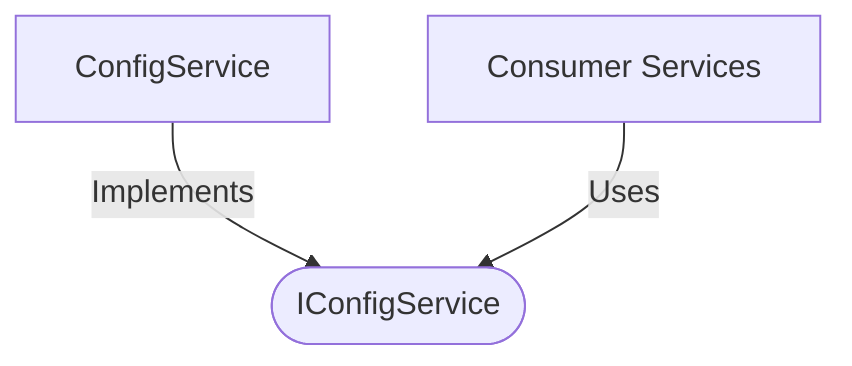

[**spotify-status-bot**](../../../../README.md)

***

[spotify-status-bot](../../../../README.md) / [services/config/types](../README.md) / IConfigService

# Interface: IConfigService

Defined in: [src/services/config/types.ts:96](https://github.com/tehJimboJones/spotify-slack-status-sync/blob/1e46a35f98db5d61d3f91586400e86d860cce2c4/src/services/config/types.ts#L96)

Interface for application configuration retrieval.

## Remarks

Provides controlled, immutable access to application configuration slices, decoupling services from direct `process.env` access.

### Relationships


## Example

```typescript
const port = configService.get().port;
```

## Methods

### getBotConfig()

> **getBotConfig**(): `object`

Defined in: [src/services/config/types.ts:99](https://github.com/tehJimboJones/spotify-slack-status-sync/blob/1e46a35f98db5d61d3f91586400e86d860cce2c4/src/services/config/types.ts#L99)

#### Returns

`object`

##### baseUrl

> **baseUrl**: `string`

##### pausedEmoji

> **pausedEmoji**: `string`

##### pollIntervalMs

> **pollIntervalMs**: `number`

##### port

> **port**: `number`

##### statusEmoji

> **statusEmoji**: `string`

##### statusFormat

> **statusFormat**: `string`

***

### getDbConfig()

> **getDbConfig**(): `object`

Defined in: [src/services/config/types.ts:100](https://github.com/tehJimboJones/spotify-slack-status-sync/blob/1e46a35f98db5d61d3f91586400e86d860cce2c4/src/services/config/types.ts#L100)

#### Returns

`object`

##### dialect

> **dialect**: `"mysql"` \| `"sqlite"`

##### host

> **host**: `string`

##### name

> **name**: `string`

##### pass

> **pass**: `string`

##### port

> **port**: `number`

##### storage?

> `optional` **storage?**: `string`

##### user

> **user**: `string`

***

### getFullConfig()

> **getFullConfig**(): [`AppConfig`](AppConfig.md)

Defined in: [src/services/config/types.ts:101](https://github.com/tehJimboJones/spotify-slack-status-sync/blob/1e46a35f98db5d61d3f91586400e86d860cce2c4/src/services/config/types.ts#L101)

#### Returns

[`AppConfig`](AppConfig.md)

***

### getSlackConfig()

> **getSlackConfig**(): `object`

Defined in: [src/services/config/types.ts:98](https://github.com/tehJimboJones/spotify-slack-status-sync/blob/1e46a35f98db5d61d3f91586400e86d860cce2c4/src/services/config/types.ts#L98)

#### Returns

`object`

##### appToken?

> `optional` **appToken?**: `string`

##### clientId

> **clientId**: `string`

##### clientSecret

> **clientSecret**: `string`

##### signingSecret

> **signingSecret**: `string`

##### userToken

> **userToken**: `string`

***

### getSpotifyConfig()

> **getSpotifyConfig**(): `object`

Defined in: [src/services/config/types.ts:97](https://github.com/tehJimboJones/spotify-slack-status-sync/blob/1e46a35f98db5d61d3f91586400e86d860cce2c4/src/services/config/types.ts#L97)

#### Returns

`object`

##### clientId

> **clientId**: `string`

##### clientSecret

> **clientSecret**: `string`

##### redirectUri

> **redirectUri**: `string`

##### refreshToken

> **refreshToken**: `string`
