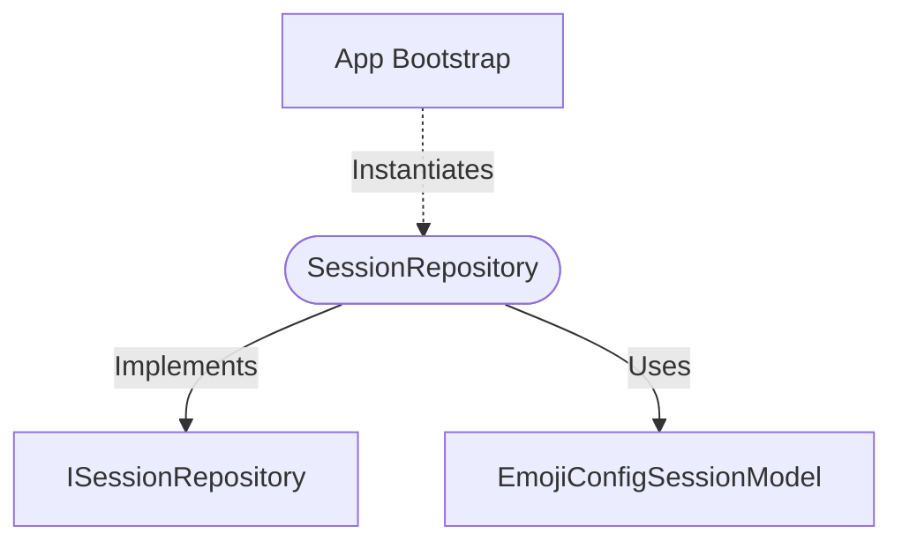

[**spotify-status-bot**](../../../../README.md)

***

[spotify-status-bot](../../../../README.md) / [services/session/session.repository](../README.md) / SessionRepository

# Class: SessionRepository

Defined in: [src/services/session/session.repository.ts:36](https://github.com/tehJimboJones/spotify-slack-status-sync/blob/1e46a35f98db5d61d3f91586400e86d860cce2c4/src/services/session/session.repository.ts#L36)

Concrete repository for managing sessions.

## Remarks

Provides data access for transient session state utilizing the Sequelize ORM and the EmojiConfigSessionModel.

### Relationships


## Example

```typescript
const sessionRepo = new SessionRepository();
```

## Implements

- [`ISessionRepository`](../../types/interfaces/ISessionRepository.md)

## Constructors

### Constructor

> **new SessionRepository**(): `SessionRepository`

#### Returns

`SessionRepository`

## Methods

### createSession()

> **createSession**(`session`): `Promise`\<[`EmojiConfigSession`](../../types/interfaces/EmojiConfigSession.md)\>

Defined in: [src/services/session/session.repository.ts:37](https://github.com/tehJimboJones/spotify-slack-status-sync/blob/1e46a35f98db5d61d3f91586400e86d860cce2c4/src/services/session/session.repository.ts#L37)

#### Parameters

##### session

`Omit`\<[`EmojiConfigSession`](../../types/interfaces/EmojiConfigSession.md), `"id"`\>

#### Returns

`Promise`\<[`EmojiConfigSession`](../../types/interfaces/EmojiConfigSession.md)\>

#### Implementation of

[`ISessionRepository`](../../types/interfaces/ISessionRepository.md).[`createSession`](../../types/interfaces/ISessionRepository.md#createsession)

***

### deleteSession()

> **deleteSession**(`id`): `Promise`\<`void`\>

Defined in: [src/services/session/session.repository.ts:57](https://github.com/tehJimboJones/spotify-slack-status-sync/blob/1e46a35f98db5d61d3f91586400e86d860cce2c4/src/services/session/session.repository.ts#L57)

#### Parameters

##### id

`number`

#### Returns

`Promise`\<`void`\>

#### Implementation of

[`ISessionRepository`](../../types/interfaces/ISessionRepository.md).[`deleteSession`](../../types/interfaces/ISessionRepository.md#deletesession)

***

### deleteSessionsByMessageTs()

> **deleteSessionsByMessageTs**(`messageTsList`): `Promise`\<`void`\>

Defined in: [src/services/session/session.repository.ts:63](https://github.com/tehJimboJones/spotify-slack-status-sync/blob/1e46a35f98db5d61d3f91586400e86d860cce2c4/src/services/session/session.repository.ts#L63)

#### Parameters

##### messageTsList

`string`[]

#### Returns

`Promise`\<`void`\>

#### Implementation of

[`ISessionRepository`](../../types/interfaces/ISessionRepository.md).[`deleteSessionsByMessageTs`](../../types/interfaces/ISessionRepository.md#deletesessionsbymessagets)

***

### findActiveSessions()

> **findActiveSessions**(`userId`): `Promise`\<[`EmojiConfigSession`](../../types/interfaces/EmojiConfigSession.md)[]\>

Defined in: [src/services/session/session.repository.ts:43](https://github.com/tehJimboJones/spotify-slack-status-sync/blob/1e46a35f98db5d61d3f91586400e86d860cce2c4/src/services/session/session.repository.ts#L43)

#### Parameters

##### userId

`string`

#### Returns

`Promise`\<[`EmojiConfigSession`](../../types/interfaces/EmojiConfigSession.md)[]\>

#### Implementation of

[`ISessionRepository`](../../types/interfaces/ISessionRepository.md).[`findActiveSessions`](../../types/interfaces/ISessionRepository.md#findactivesessions)

***

### findByMessageTs()

> **findByMessageTs**(`messageTs`): `Promise`\<[`EmojiConfigSession`](../../types/interfaces/EmojiConfigSession.md) \| `null`\>

Defined in: [src/services/session/session.repository.ts:50](https://github.com/tehJimboJones/spotify-slack-status-sync/blob/1e46a35f98db5d61d3f91586400e86d860cce2c4/src/services/session/session.repository.ts#L50)

#### Parameters

##### messageTs

`string`

#### Returns

`Promise`\<[`EmojiConfigSession`](../../types/interfaces/EmojiConfigSession.md) \| `null`\>

#### Implementation of

[`ISessionRepository`](../../types/interfaces/ISessionRepository.md).[`findByMessageTs`](../../types/interfaces/ISessionRepository.md#findbymessagets)
