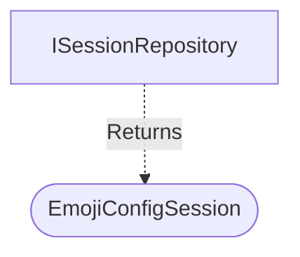

[**spotify-status-bot**](../../../../README.md)

***

[spotify-status-bot](../../../../README.md) / [services/session/types](../README.md) / EmojiConfigSession

# Interface: EmojiConfigSession

Defined in: [src/services/session/types.ts:32](https://github.com/tehJimboJones/spotify-slack-status-sync/blob/1e46a35f98db5d61d3f91586400e86d860cce2c4/src/services/session/types.ts#L32)

Domain model for an emoji configuration session.

## Remarks

Represents the transient state required when a user is actively picking an emoji via Slack reactions, tracking the message and user involved.

### Relationships


## Example

```typescript
const session: EmojiConfigSession = { userId: 'U123', messageTs: '12345.67' };
```

## Properties

### channelId

> **channelId**: `string`

Defined in: [src/services/session/types.ts:35](https://github.com/tehJimboJones/spotify-slack-status-sync/blob/1e46a35f98db5d61d3f91586400e86d860cce2c4/src/services/session/types.ts#L35)

***

### id

> **id**: `number`

Defined in: [src/services/session/types.ts:33](https://github.com/tehJimboJones/spotify-slack-status-sync/blob/1e46a35f98db5d61d3f91586400e86d860cce2c4/src/services/session/types.ts#L33)

***

### messageTs

> **messageTs**: `string`

Defined in: [src/services/session/types.ts:36](https://github.com/tehJimboJones/spotify-slack-status-sync/blob/1e46a35f98db5d61d3f91586400e86d860cce2c4/src/services/session/types.ts#L36)

***

### settingType

> **settingType**: `"statusEmoji"` \| `"pausedEmoji"` \| `"podcastStatusEmoji"` \| `"podcastPausedEmoji"`

Defined in: [src/services/session/types.ts:37](https://github.com/tehJimboJones/spotify-slack-status-sync/blob/1e46a35f98db5d61d3f91586400e86d860cce2c4/src/services/session/types.ts#L37)

***

### userId

> **userId**: `string`

Defined in: [src/services/session/types.ts:34](https://github.com/tehJimboJones/spotify-slack-status-sync/blob/1e46a35f98db5d61d3f91586400e86d860cce2c4/src/services/session/types.ts#L34)
