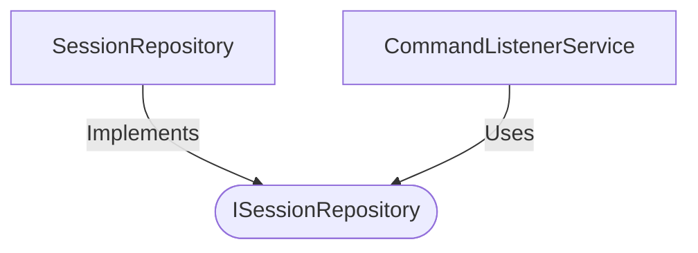

[**spotify-status-bot**](../../../../README.md)

***

[spotify-status-bot](../../../../README.md) / [services/session/types](../README.md) / ISessionRepository

# Interface: ISessionRepository

Defined in: [src/services/session/types.ts:61](https://github.com/tehJimboJones/spotify-slack-status-sync/blob/1e46a35f98db5d61d3f91586400e86d860cce2c4/src/services/session/types.ts#L61)

Data access interface for transient sessions.

## Remarks

Abstracts the persistence mechanism for temporary interactive workflows, such as multi-step Slack configuration prompts.

### Relationships


## Example

```typescript
await sessionRepo.createSession('U123', '123.45');
```

## Methods

### createSession()

> **createSession**(`session`): `Promise`\<[`EmojiConfigSession`](EmojiConfigSession.md)\>

Defined in: [src/services/session/types.ts:62](https://github.com/tehJimboJones/spotify-slack-status-sync/blob/1e46a35f98db5d61d3f91586400e86d860cce2c4/src/services/session/types.ts#L62)

#### Parameters

##### session

`Omit`\<[`EmojiConfigSession`](EmojiConfigSession.md), `"id"`\>

#### Returns

`Promise`\<[`EmojiConfigSession`](EmojiConfigSession.md)\>

***

### deleteSession()

> **deleteSession**(`id`): `Promise`\<`void`\>

Defined in: [src/services/session/types.ts:65](https://github.com/tehJimboJones/spotify-slack-status-sync/blob/1e46a35f98db5d61d3f91586400e86d860cce2c4/src/services/session/types.ts#L65)

#### Parameters

##### id

`number`

#### Returns

`Promise`\<`void`\>

***

### deleteSessionsByMessageTs()

> **deleteSessionsByMessageTs**(`messageTs`): `Promise`\<`void`\>

Defined in: [src/services/session/types.ts:66](https://github.com/tehJimboJones/spotify-slack-status-sync/blob/1e46a35f98db5d61d3f91586400e86d860cce2c4/src/services/session/types.ts#L66)

#### Parameters

##### messageTs

`string`[]

#### Returns

`Promise`\<`void`\>

***

### findActiveSessions()

> **findActiveSessions**(`userId`): `Promise`\<[`EmojiConfigSession`](EmojiConfigSession.md)[]\>

Defined in: [src/services/session/types.ts:63](https://github.com/tehJimboJones/spotify-slack-status-sync/blob/1e46a35f98db5d61d3f91586400e86d860cce2c4/src/services/session/types.ts#L63)

#### Parameters

##### userId

`string`

#### Returns

`Promise`\<[`EmojiConfigSession`](EmojiConfigSession.md)[]\>

***

### findByMessageTs()

> **findByMessageTs**(`messageTs`): `Promise`\<[`EmojiConfigSession`](EmojiConfigSession.md) \| `null`\>

Defined in: [src/services/session/types.ts:64](https://github.com/tehJimboJones/spotify-slack-status-sync/blob/1e46a35f98db5d61d3f91586400e86d860cce2c4/src/services/session/types.ts#L64)

#### Parameters

##### messageTs

`string`

#### Returns

`Promise`\<[`EmojiConfigSession`](EmojiConfigSession.md) \| `null`\>
