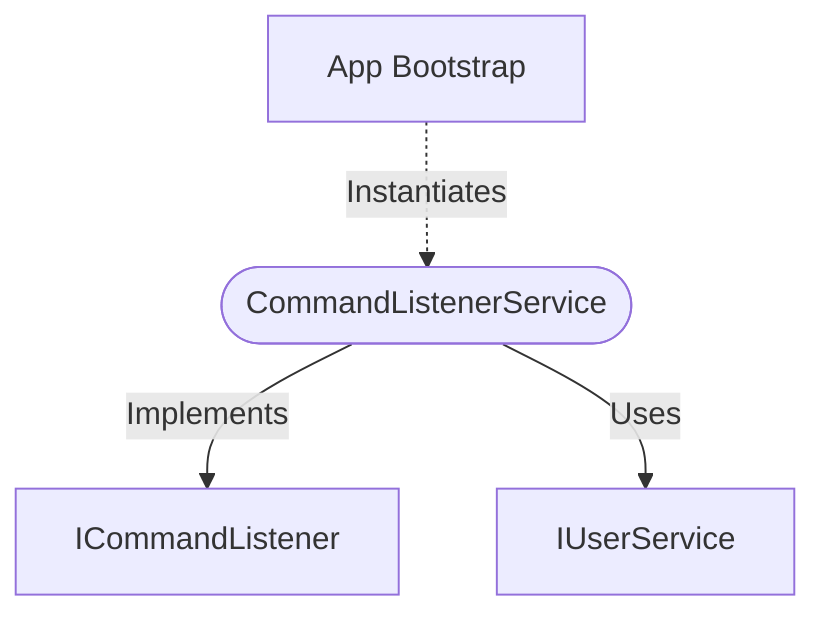

[**spotify-status-bot**](../../../../../README.md)

***

[spotify-status-bot](../../../../../README.md) / [services/slack/command/command-listener.service](../README.md) / CommandListenerService

# Class: CommandListenerService

Defined in: [src/services/slack/command/command-listener.service.ts:40](https://github.com/tehJimboJones/spotify-slack-status-sync/blob/1e46a35f98db5d61d3f91586400e86d860cce2c4/src/services/slack/command/command-listener.service.ts#L40)

Handler for bot-specific slash commands.

## Remarks

Parses and routes slash command text (e.g., 'on', 'off', 'settings') to the appropriate internal services to perform the requested action.

### Relationships


## Example

```typescript
const commandListener = new CommandListenerService(userService, slackService);
```

## Implements

- [`ICommandListener`](../../types/interfaces/ICommandListener.md)

## Constructors

### Constructor

> **new CommandListenerService**(`userService`, `configService`, `sessionRepository?`): `CommandListenerService`

Defined in: [src/services/slack/command/command-listener.service.ts:43](https://github.com/tehJimboJones/spotify-slack-status-sync/blob/1e46a35f98db5d61d3f91586400e86d860cce2c4/src/services/slack/command/command-listener.service.ts#L43)

#### Parameters

##### userService

[`IUserService`](../../../../user/types/interfaces/IUserService.md)

##### configService

[`IConfigService`](../../../../config/types/interfaces/IConfigService.md)

##### sessionRepository?

[`ISessionRepository`](../../../../session/types/interfaces/ISessionRepository.md)

#### Returns

`CommandListenerService`

## Properties

### commandName

> `readonly` **commandName**: `"/spotifystatus"` = `'/spotifystatus'`

Defined in: [src/services/slack/command/command-listener.service.ts:41](https://github.com/tehJimboJones/spotify-slack-status-sync/blob/1e46a35f98db5d61d3f91586400e86d860cce2c4/src/services/slack/command/command-listener.service.ts#L41)

#### Implementation of

[`ICommandListener`](../../types/interfaces/ICommandListener.md).[`commandName`](../../types/interfaces/ICommandListener.md#commandname)

## Methods

### handle()

> **handle**(`context`, `slackService`): `Promise`\<`void`\>

Defined in: [src/services/slack/command/command-listener.service.ts:49](https://github.com/tehJimboJones/spotify-slack-status-sync/blob/1e46a35f98db5d61d3f91586400e86d860cce2c4/src/services/slack/command/command-listener.service.ts#L49)

#### Parameters

##### context

[`ICommandContext`](../../types/interfaces/ICommandContext.md)

##### slackService

[`ISlackService`](../../../types/interfaces/ISlackService.md)

#### Returns

`Promise`\<`void`\>

#### Implementation of

[`ICommandListener`](../../types/interfaces/ICommandListener.md).[`handle`](../../types/interfaces/ICommandListener.md#handle)
