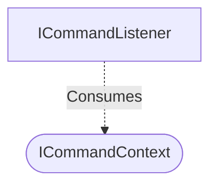

[**spotify-status-bot**](../../../../../README.md)

***

[spotify-status-bot](../../../../../README.md) / [services/slack/command/types](../README.md) / ICommandContext

# Interface: ICommandContext

Defined in: [src/services/slack/command/types.ts:34](https://github.com/tehJimboJones/spotify-slack-status-sync/blob/1e46a35f98db5d61d3f91586400e86d860cce2c4/src/services/slack/command/types.ts#L34)

Context payload for Slack slash commands.

## Remarks

Standardizes the data received from Slack when a slash command is invoked, decoupling listeners from framework-specific payloads.

### Relationships


## Example

```typescript
const ctx: ICommandContext = { command: '/spotify', text: 'on', user: 'U123' };
```

## Properties

### respond

> **respond**: (`text`) => `Promise`\<`void`\>

Defined in: [src/services/slack/command/types.ts:38](https://github.com/tehJimboJones/spotify-slack-status-sync/blob/1e46a35f98db5d61d3f91586400e86d860cce2c4/src/services/slack/command/types.ts#L38)

#### Parameters

##### text

`string`

#### Returns

`Promise`\<`void`\>

***

### text

> **text**: `string`

Defined in: [src/services/slack/command/types.ts:37](https://github.com/tehJimboJones/spotify-slack-status-sync/blob/1e46a35f98db5d61d3f91586400e86d860cce2c4/src/services/slack/command/types.ts#L37)

***

### triggerId

> **triggerId**: `string`

Defined in: [src/services/slack/command/types.ts:36](https://github.com/tehJimboJones/spotify-slack-status-sync/blob/1e46a35f98db5d61d3f91586400e86d860cce2c4/src/services/slack/command/types.ts#L36)

***

### userId

> **userId**: `string`

Defined in: [src/services/slack/command/types.ts:35](https://github.com/tehJimboJones/spotify-slack-status-sync/blob/1e46a35f98db5d61d3f91586400e86d860cce2c4/src/services/slack/command/types.ts#L35)
