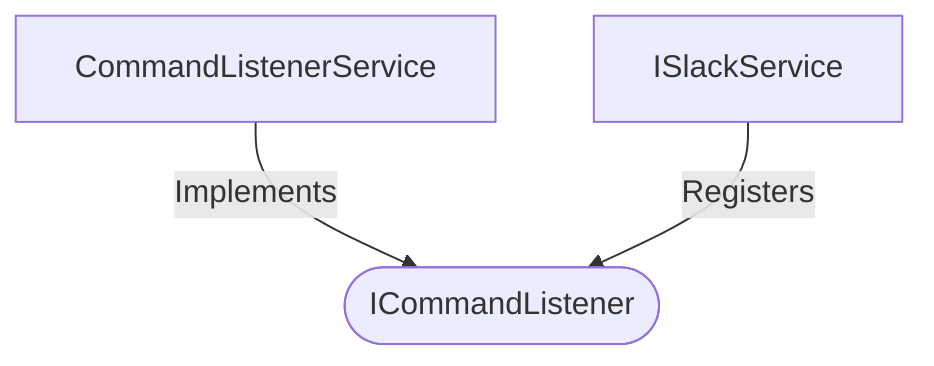

[**spotify-status-bot**](../../../../../README.md)

***

[spotify-status-bot](../../../../../README.md) / [services/slack/command/types](../README.md) / ICommandListener

# Interface: ICommandListener

Defined in: [src/services/slack/command/types.ts:62](https://github.com/tehJimboJones/spotify-slack-status-sync/blob/1e46a35f98db5d61d3f91586400e86d860cce2c4/src/services/slack/command/types.ts#L62)

Interface for handling Slack slash commands.

## Remarks

Defines the contract for processing specific slash command invocations, allowing multiple command behaviors to be registered independently.

### Relationships


## Example

```typescript
slackService.registerCommandListener('/spotify', commandListener);
```

## Properties

### commandName

> **commandName**: `string`

Defined in: [src/services/slack/command/types.ts:63](https://github.com/tehJimboJones/spotify-slack-status-sync/blob/1e46a35f98db5d61d3f91586400e86d860cce2c4/src/services/slack/command/types.ts#L63)

## Methods

### handle()

> **handle**(`context`, `slackService`): `Promise`\<`void`\>

Defined in: [src/services/slack/command/types.ts:64](https://github.com/tehJimboJones/spotify-slack-status-sync/blob/1e46a35f98db5d61d3f91586400e86d860cce2c4/src/services/slack/command/types.ts#L64)

#### Parameters

##### context

[`ICommandContext`](ICommandContext.md)

##### slackService

[`ISlackService`](../../../types/interfaces/ISlackService.md)

#### Returns

`Promise`\<`void`\>
