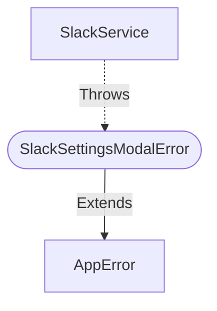

[**spotify-status-bot**](../../../../README.md)

***

[spotify-status-bot](../../../../README.md) / [services/slack/errors](../README.md) / SlackSettingsModalError

# Class: SlackSettingsModalError

Defined in: [src/services/slack/errors.ts:138](https://github.com/tehJimboJones/spotify-slack-status-sync/blob/1e46a35f98db5d61d3f91586400e86d860cce2c4/src/services/slack/errors.ts#L138)

Exception for Slack modal rendering failures.

## Remarks

Thrown when the application cannot successfully construct or open the interactive settings modal for a user.

### Relationships


## Example

```typescript
throw new SlackSettingsModalError('Failed to open settings modal');
```

## Extends

- [`AppError`](../../../../errors/classes/AppError.md)

## Constructors

### Constructor

> **new SlackSettingsModalError**(`message?`): `SlackSettingsModalError`

Defined in: [src/services/slack/errors.ts:139](https://github.com/tehJimboJones/spotify-slack-status-sync/blob/1e46a35f98db5d61d3f91586400e86d860cce2c4/src/services/slack/errors.ts#L139)

#### Parameters

##### message?

`string` = `'Failed to open Slack settings modal'`

#### Returns

`SlackSettingsModalError`

#### Overrides

[`AppError`](../../../../errors/classes/AppError.md).[`constructor`](../../../../errors/classes/AppError.md#constructor)

## Properties

### cause?

> `optional` **cause?**: `unknown`

Defined in: node\_modules/typescript/lib/lib.es2022.error.d.ts:26

#### Inherited from

[`AppError`](../../../../errors/classes/AppError.md).[`cause`](../../../../errors/classes/AppError.md#cause)

***

### code

> `readonly` **code**: `string`

Defined in: [src/errors.ts:33](https://github.com/tehJimboJones/spotify-slack-status-sync/blob/1e46a35f98db5d61d3f91586400e86d860cce2c4/src/errors.ts#L33)

#### Inherited from

[`AppError`](../../../../errors/classes/AppError.md).[`code`](../../../../errors/classes/AppError.md#code)

***

### message

> **message**: `string`

Defined in: node\_modules/typescript/lib/lib.es5.d.ts:1077

#### Inherited from

[`AppError`](../../../../errors/classes/AppError.md).[`message`](../../../../errors/classes/AppError.md#message)

***

### name

> **name**: `string`

Defined in: node\_modules/typescript/lib/lib.es5.d.ts:1076

#### Inherited from

[`AppError`](../../../../errors/classes/AppError.md).[`name`](../../../../errors/classes/AppError.md#name)

***

### stack?

> `optional` **stack?**: `string`

Defined in: node\_modules/typescript/lib/lib.es5.d.ts:1078

#### Inherited from

[`AppError`](../../../../errors/classes/AppError.md).[`stack`](../../../../errors/classes/AppError.md#stack)

***

### stackTraceLimit

> `static` **stackTraceLimit**: `number`

Defined in: node\_modules/@types/node/globals.d.ts:68

The `Error.stackTraceLimit` property specifies the number of stack frames
collected by a stack trace (whether generated by `new Error().stack` or
`Error.captureStackTrace(obj)`).

The default value is `10` but may be set to any valid JavaScript number. Changes
will affect any stack trace captured _after_ the value has been changed.

If set to a non-number value, or set to a negative number, stack traces will
not capture any frames.

#### Inherited from

[`AppError`](../../../../errors/classes/AppError.md).[`stackTraceLimit`](../../../../errors/classes/AppError.md#stacktracelimit)

## Methods

### captureStackTrace()

> `static` **captureStackTrace**(`targetObject`, `constructorOpt?`): `void`

Defined in: node\_modules/@types/node/globals.d.ts:52

Creates a `.stack` property on `targetObject`, which when accessed returns
a string representing the location in the code at which
`Error.captureStackTrace()` was called.

```js
const myObject = {};
Error.captureStackTrace(myObject);
myObject.stack;  // Similar to `new Error().stack`
```

The first line of the trace will be prefixed with
`${myObject.name}: ${myObject.message}`.

The optional `constructorOpt` argument accepts a function. If given, all frames
above `constructorOpt`, including `constructorOpt`, will be omitted from the
generated stack trace.

The `constructorOpt` argument is useful for hiding implementation
details of error generation from the user. For instance:

```js
function a() {
  b();
}

function b() {
  c();
}

function c() {
  // Create an error without stack trace to avoid calculating the stack trace twice.
  const { stackTraceLimit } = Error;
  Error.stackTraceLimit = 0;
  const error = new Error();
  Error.stackTraceLimit = stackTraceLimit;

  // Capture the stack trace above function b
  Error.captureStackTrace(error, b); // Neither function c, nor b is included in the stack trace
  throw error;
}

a();
```

#### Parameters

##### targetObject

`object`

##### constructorOpt?

`Function`

#### Returns

`void`

#### Inherited from

[`AppError`](../../../../errors/classes/AppError.md).[`captureStackTrace`](../../../../errors/classes/AppError.md#capturestacktrace)

***

### prepareStackTrace()

> `static` **prepareStackTrace**(`err`, `stackTraces`): `any`

Defined in: node\_modules/@types/node/globals.d.ts:56

#### Parameters

##### err

`Error`

##### stackTraces

`CallSite`[]

#### Returns

`any`

#### See

https://v8.dev/docs/stack-trace-api#customizing-stack-traces

#### Inherited from

[`AppError`](../../../../errors/classes/AppError.md).[`prepareStackTrace`](../../../../errors/classes/AppError.md#preparestacktrace)
