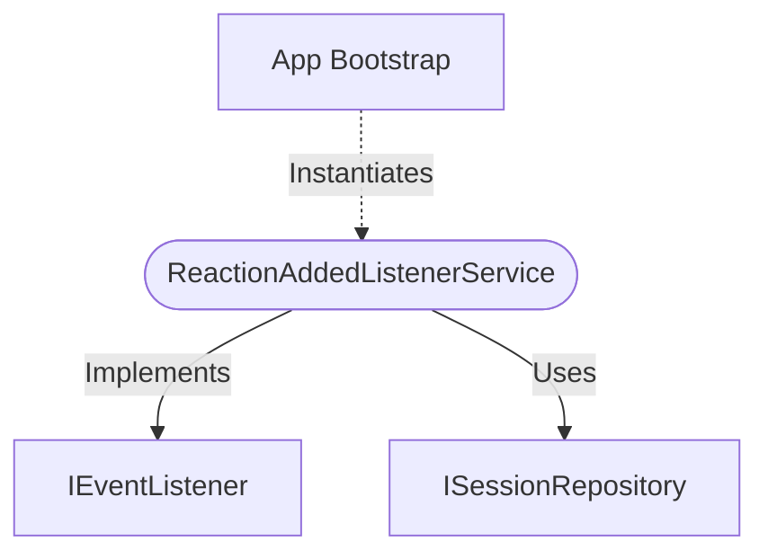

[**spotify-status-bot**](../../../../../README.md)

***

[spotify-status-bot](../../../../../README.md) / [services/slack/event/reaction-added-listener.service](../README.md) / ReactionAddedListenerService

# Class: ReactionAddedListenerService

Defined in: [src/services/slack/event/reaction-added-listener.service.ts:37](https://github.com/tehJimboJones/spotify-slack-status-sync/blob/1e46a35f98db5d61d3f91586400e86d860cce2c4/src/services/slack/event/reaction-added-listener.service.ts#L37)

Handler for the `reaction_added` Slack event.

## Remarks

Processes user emoji reactions, specifically looking for interactions related to the emoji configuration workflow to capture user preferences.

### Relationships


## Example

```typescript
const listener = new ReactionAddedListenerService(sessionRepo);
```

## Implements

- [`IEventListener`](../../../types/interfaces/IEventListener.md)

## Constructors

### Constructor

> **new ReactionAddedListenerService**(`userService`, `sessionRepository`): `ReactionAddedListenerService`

Defined in: [src/services/slack/event/reaction-added-listener.service.ts:40](https://github.com/tehJimboJones/spotify-slack-status-sync/blob/1e46a35f98db5d61d3f91586400e86d860cce2c4/src/services/slack/event/reaction-added-listener.service.ts#L40)

#### Parameters

##### userService

[`IUserService`](../../../../user/types/interfaces/IUserService.md)

##### sessionRepository

[`ISessionRepository`](../../../../session/types/interfaces/ISessionRepository.md)

#### Returns

`ReactionAddedListenerService`

## Properties

### eventName

> `readonly` **eventName**: `"reaction_added"` = `'reaction_added'`

Defined in: [src/services/slack/event/reaction-added-listener.service.ts:38](https://github.com/tehJimboJones/spotify-slack-status-sync/blob/1e46a35f98db5d61d3f91586400e86d860cce2c4/src/services/slack/event/reaction-added-listener.service.ts#L38)

#### Implementation of

[`IEventListener`](../../../types/interfaces/IEventListener.md).[`eventName`](../../../types/interfaces/IEventListener.md#eventname)

## Methods

### handle()

> **handle**(`context`, `slackService`): `Promise`\<`void`\>

Defined in: [src/services/slack/event/reaction-added-listener.service.ts:45](https://github.com/tehJimboJones/spotify-slack-status-sync/blob/1e46a35f98db5d61d3f91586400e86d860cce2c4/src/services/slack/event/reaction-added-listener.service.ts#L45)

#### Parameters

##### context

[`IEventContext`](../../../types/interfaces/IEventContext.md)

##### slackService

[`ISlackService`](../../../types/interfaces/ISlackService.md)

#### Returns

`Promise`\<`void`\>

#### Implementation of

[`IEventListener`](../../../types/interfaces/IEventListener.md).[`handle`](../../../types/interfaces/IEventListener.md#handle)
