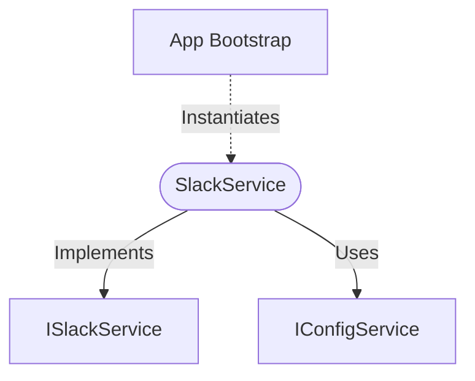

[**spotify-status-bot**](../../../../README.md)

***

[spotify-status-bot](../../../../README.md) / [services/slack/slack.service](../README.md) / SlackService

# Class: SlackService

Defined in: [src/services/slack/slack.service.ts:47](https://github.com/tehJimboJones/spotify-slack-status-sync/blob/1e46a35f98db5d61d3f91586400e86d860cce2c4/src/services/slack/slack.service.ts#L47)

Concrete implementation of the Slack integration.

## Remarks

Wraps the `@slack/bolt` framework, managing the bot's WebSocket connection and mediating all outbound calls and inbound events.

### Relationships


## Example

```typescript
const slackService = new SlackService(configService);
```

## Implements

- [`ISlackService`](../../types/interfaces/ISlackService.md)

## Constructors

### Constructor

> **new SlackService**(`configService`): `SlackService`

Defined in: [src/services/slack/slack.service.ts:50](https://github.com/tehJimboJones/spotify-slack-status-sync/blob/1e46a35f98db5d61d3f91586400e86d860cce2c4/src/services/slack/slack.service.ts#L50)

#### Parameters

##### configService

[`IConfigService`](../../../config/types/interfaces/IConfigService.md)

#### Returns

`SlackService`

## Methods

### clearStatus()

> **clearStatus**(`user`): `Promise`\<`void`\>

Defined in: [src/services/slack/slack.service.ts:135](https://github.com/tehJimboJones/spotify-slack-status-sync/blob/1e46a35f98db5d61d3f91586400e86d860cce2c4/src/services/slack/slack.service.ts#L135)

#### Parameters

##### user

[`User`](../../../user/types/interfaces/User.md)

#### Returns

`Promise`\<`void`\>

#### Implementation of

[`ISlackService`](../../types/interfaces/ISlackService.md).[`clearStatus`](../../types/interfaces/ISlackService.md#clearstatus)

***

### openSettingsModal()

> **openSettingsModal**(`triggerId`, `userId`, `currentSettings`): `Promise`\<`void`\>

Defined in: [src/services/slack/slack.service.ts:176](https://github.com/tehJimboJones/spotify-slack-status-sync/blob/1e46a35f98db5d61d3f91586400e86d860cce2c4/src/services/slack/slack.service.ts#L176)

#### Parameters

##### triggerId

`string`

##### userId

`string`

##### currentSettings

`Partial`\<[`User`](../../../user/types/interfaces/User.md)\>

#### Returns

`Promise`\<`void`\>

#### Implementation of

[`ISlackService`](../../types/interfaces/ISlackService.md).[`openSettingsModal`](../../types/interfaces/ISlackService.md#opensettingsmodal)

***

### registerCommandListener()

> **registerCommandListener**(`listener`): `void`

Defined in: [src/services/slack/slack.service.ts:159](https://github.com/tehJimboJones/spotify-slack-status-sync/blob/1e46a35f98db5d61d3f91586400e86d860cce2c4/src/services/slack/slack.service.ts#L159)

#### Parameters

##### listener

[`ICommandListener`](../../command/types/interfaces/ICommandListener.md)

#### Returns

`void`

#### Implementation of

[`ISlackService`](../../types/interfaces/ISlackService.md).[`registerCommandListener`](../../types/interfaces/ISlackService.md#registercommandlistener)

***

### registerEventListener()

> **registerEventListener**(`listener`): `void`

Defined in: [src/services/slack/slack.service.ts:103](https://github.com/tehJimboJones/spotify-slack-status-sync/blob/1e46a35f98db5d61d3f91586400e86d860cce2c4/src/services/slack/slack.service.ts#L103)

#### Parameters

##### listener

[`IEventListener`](../../types/interfaces/IEventListener.md)

#### Returns

`void`

#### Implementation of

[`ISlackService`](../../types/interfaces/ISlackService.md).[`registerEventListener`](../../types/interfaces/ISlackService.md#registereventlistener)

***

### registerViewListener()

> **registerViewListener**(`listener`): `void`

Defined in: [src/services/slack/slack.service.ts:109](https://github.com/tehJimboJones/spotify-slack-status-sync/blob/1e46a35f98db5d61d3f91586400e86d860cce2c4/src/services/slack/slack.service.ts#L109)

#### Parameters

##### listener

[`IViewListener`](../../view/types/interfaces/IViewListener.md)

#### Returns

`void`

#### Implementation of

[`ISlackService`](../../types/interfaces/ISlackService.md).[`registerViewListener`](../../types/interfaces/ISlackService.md#registerviewlistener)

***

### sendMessage()

> **sendMessage**(`channelOrUserId`, `text`): `Promise`\<\{ `channel`: `string`; `messageTimestamp`: `string`; \} \| `null`\>

Defined in: [src/services/slack/slack.service.ts:59](https://github.com/tehJimboJones/spotify-slack-status-sync/blob/1e46a35f98db5d61d3f91586400e86d860cce2c4/src/services/slack/slack.service.ts#L59)

#### Parameters

##### channelOrUserId

`string`

##### text

`string`

#### Returns

`Promise`\<\{ `channel`: `string`; `messageTimestamp`: `string`; \} \| `null`\>

#### Implementation of

[`ISlackService`](../../types/interfaces/ISlackService.md).[`sendMessage`](../../types/interfaces/ISlackService.md#sendmessage)

***

### setStatus()

> **setStatus**(`user`, `text`, `emoji`): `Promise`\<`void`\>

Defined in: [src/services/slack/slack.service.ts:116](https://github.com/tehJimboJones/spotify-slack-status-sync/blob/1e46a35f98db5d61d3f91586400e86d860cce2c4/src/services/slack/slack.service.ts#L116)

#### Parameters

##### user

[`User`](../../../user/types/interfaces/User.md)

##### text

`string`

##### emoji

`string`

#### Returns

`Promise`\<`void`\>

#### Implementation of

[`ISlackService`](../../types/interfaces/ISlackService.md).[`setStatus`](../../types/interfaces/ISlackService.md#setstatus)

***

### start()

> **start**(): `Promise`\<`void`\>

Defined in: [src/services/slack/slack.service.ts:154](https://github.com/tehJimboJones/spotify-slack-status-sync/blob/1e46a35f98db5d61d3f91586400e86d860cce2c4/src/services/slack/slack.service.ts#L154)

#### Returns

`Promise`\<`void`\>

#### Implementation of

[`ISlackService`](../../types/interfaces/ISlackService.md).[`start`](../../types/interfaces/ISlackService.md#start)

***

### updateMessage()

> **updateMessage**(`channel`, `messageTimestamp`, `text`): `Promise`\<`void`\>

Defined in: [src/services/slack/slack.service.ts:84](https://github.com/tehJimboJones/spotify-slack-status-sync/blob/1e46a35f98db5d61d3f91586400e86d860cce2c4/src/services/slack/slack.service.ts#L84)

#### Parameters

##### channel

`string`

##### messageTimestamp

`string`

##### text

`string`

#### Returns

`Promise`\<`void`\>

#### Implementation of

[`ISlackService`](../../types/interfaces/ISlackService.md).[`updateMessage`](../../types/interfaces/ISlackService.md#updatemessage)
