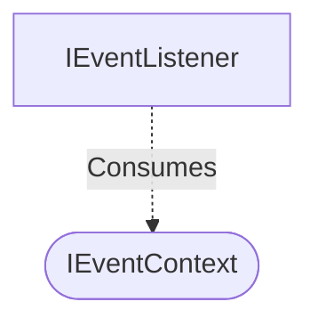

[**spotify-status-bot**](../../../../README.md)

***

[spotify-status-bot](../../../../README.md) / [services/slack/types](../README.md) / IEventContext

# Interface: IEventContext

Defined in: [src/services/slack/types.ts:39](https://github.com/tehJimboJones/spotify-slack-status-sync/blob/1e46a35f98db5d61d3f91586400e86d860cce2c4/src/services/slack/types.ts#L39)

Context payload for Slack events.

## Remarks

Encapsulates the event payload provided by the Slack Bolt API, standardizing data access across different event listeners.

### Relationships


## Example

```typescript
const ctx: IEventContext = { event: { type: 'reaction_added' } };
```

## Properties

### body

> **body**: `Record`\<`string`, `unknown`\>

Defined in: [src/services/slack/types.ts:40](https://github.com/tehJimboJones/spotify-slack-status-sync/blob/1e46a35f98db5d61d3f91586400e86d860cce2c4/src/services/slack/types.ts#L40)

***

### event

> **event**: [`SlackEvent`](../type-aliases/SlackEvent.md)

Defined in: [src/services/slack/types.ts:41](https://github.com/tehJimboJones/spotify-slack-status-sync/blob/1e46a35f98db5d61d3f91586400e86d860cce2c4/src/services/slack/types.ts#L41)
