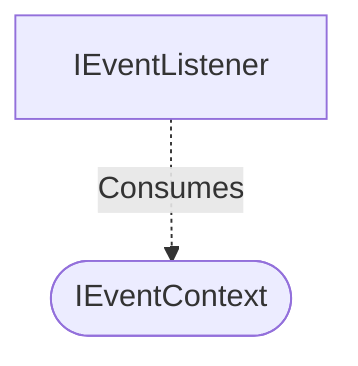

[**spotify-status-bot**](../../../../README.md)

***

[spotify-status-bot](../../../../README.md) / [services/slack/types](../README.md) / IEventContext

# Interface: IEventContext

Defined in: [src/services/slack/types.ts:54](https://github.com/tehJimboJones/spotify-slack-status-sync/blob/1402fbb61b76cfa6bdbfdcbea9a2cb5b97347808/src/services/slack/types.ts#L54)

Context payload for Slack events.

## Remarks

Encapsulates the event payload provided by the Slack Bolt API, standardizing data access across different event listeners.

### Relationships

```mermaid
graph TD
IEventContext([IEventContext])
IEventListener[IEventListener] -.->|Consumes| IEventContext
```

## Example

```typescript
const ctx: IEventContext = { event: { type: 'reaction_added' } };
```

## Properties

### body

> **body**: `Record`\<`string`, `unknown`\>

Defined in: [src/services/slack/types.ts:55](https://github.com/tehJimboJones/spotify-slack-status-sync/blob/1402fbb61b76cfa6bdbfdcbea9a2cb5b97347808/src/services/slack/types.ts#L55)

***

### event

> **event**: [`SlackEvent`](../type-aliases/SlackEvent.md)

Defined in: [src/services/slack/types.ts:56](https://github.com/tehJimboJones/spotify-slack-status-sync/blob/1402fbb61b76cfa6bdbfdcbea9a2cb5b97347808/src/services/slack/types.ts#L56)
