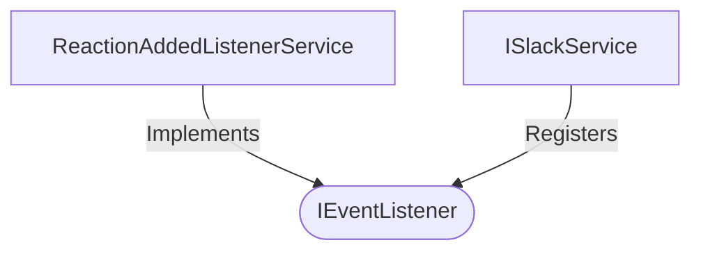

[**spotify-status-bot**](../../../../README.md)

***

[spotify-status-bot](../../../../README.md) / [services/slack/types](../README.md) / IEventListener

# Interface: IEventListener

Defined in: [src/services/slack/types.ts:65](https://github.com/tehJimboJones/spotify-slack-status-sync/blob/1e46a35f98db5d61d3f91586400e86d860cce2c4/src/services/slack/types.ts#L65)

Interface for handling Slack events.

## Remarks

Defines a contract for processing real-time Slack events (like reactions or messages), decoupled from the main Slack service.

### Relationships


## Example

```typescript
slackService.registerEventListener('reaction_added', reactionListener);
```

## Properties

### eventName

> **eventName**: `string`

Defined in: [src/services/slack/types.ts:66](https://github.com/tehJimboJones/spotify-slack-status-sync/blob/1e46a35f98db5d61d3f91586400e86d860cce2c4/src/services/slack/types.ts#L66)

## Methods

### handle()

> **handle**(`context`, `slackService`): `Promise`\<`void`\>

Defined in: [src/services/slack/types.ts:67](https://github.com/tehJimboJones/spotify-slack-status-sync/blob/1e46a35f98db5d61d3f91586400e86d860cce2c4/src/services/slack/types.ts#L67)

#### Parameters

##### context

[`IEventContext`](IEventContext.md)

##### slackService

[`ISlackService`](ISlackService.md)

#### Returns

`Promise`\<`void`\>
