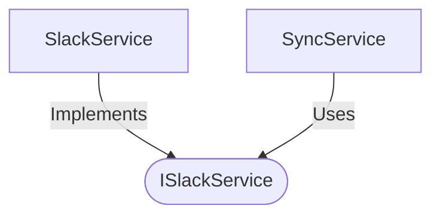

[**spotify-status-bot**](../../../../README.md)

***

[spotify-status-bot](../../../../README.md) / [services/slack/types](../README.md) / ISlackService

# Interface: ISlackService

Defined in: [src/services/slack/types.ts:91](https://github.com/tehJimboJones/spotify-slack-status-sync/blob/1e46a35f98db5d61d3f91586400e86d860cce2c4/src/services/slack/types.ts#L91)

Interface for Slack API interactions.

## Remarks

Abstracts the Slack bot client, providing methods to send messages, update statuses, and register event/command/view listeners.

### Relationships


## Example

```typescript
await slackService.setStatus('U123', 'Working', ':computer:');
```

## Methods

### clearStatus()

> **clearStatus**(`user`): `Promise`\<`void`\>

Defined in: [src/services/slack/types.ts:98](https://github.com/tehJimboJones/spotify-slack-status-sync/blob/1e46a35f98db5d61d3f91586400e86d860cce2c4/src/services/slack/types.ts#L98)

#### Parameters

##### user

[`User`](../../../user/types/interfaces/User.md)

#### Returns

`Promise`\<`void`\>

***

### openSettingsModal()

> **openSettingsModal**(`triggerId`, `userId`, `currentSettings`): `Promise`\<`void`\>

Defined in: [src/services/slack/types.ts:103](https://github.com/tehJimboJones/spotify-slack-status-sync/blob/1e46a35f98db5d61d3f91586400e86d860cce2c4/src/services/slack/types.ts#L103)

#### Parameters

##### triggerId

`string`

##### userId

`string`

##### currentSettings

`Partial`\<[`User`](../../../user/types/interfaces/User.md)\>

#### Returns

`Promise`\<`void`\>

***

### registerCommandListener()

> **registerCommandListener**(`listener`): `void`

Defined in: [src/services/slack/types.ts:100](https://github.com/tehJimboJones/spotify-slack-status-sync/blob/1e46a35f98db5d61d3f91586400e86d860cce2c4/src/services/slack/types.ts#L100)

#### Parameters

##### listener

[`ICommandListener`](../../command/types/interfaces/ICommandListener.md)

#### Returns

`void`

***

### registerEventListener()

> **registerEventListener**(`listener`): `void`

Defined in: [src/services/slack/types.ts:102](https://github.com/tehJimboJones/spotify-slack-status-sync/blob/1e46a35f98db5d61d3f91586400e86d860cce2c4/src/services/slack/types.ts#L102)

#### Parameters

##### listener

[`IEventListener`](IEventListener.md)

#### Returns

`void`

***

### registerViewListener()

> **registerViewListener**(`listener`): `void`

Defined in: [src/services/slack/types.ts:101](https://github.com/tehJimboJones/spotify-slack-status-sync/blob/1e46a35f98db5d61d3f91586400e86d860cce2c4/src/services/slack/types.ts#L101)

#### Parameters

##### listener

[`IViewListener`](../../view/types/interfaces/IViewListener.md)

#### Returns

`void`

***

### sendMessage()

> **sendMessage**(`channelOrUserId`, `text`): `Promise`\<\{ `channel`: `string`; `messageTimestamp`: `string`; \} \| `null`\>

Defined in: [src/services/slack/types.ts:92](https://github.com/tehJimboJones/spotify-slack-status-sync/blob/1e46a35f98db5d61d3f91586400e86d860cce2c4/src/services/slack/types.ts#L92)

#### Parameters

##### channelOrUserId

`string`

##### text

`string`

#### Returns

`Promise`\<\{ `channel`: `string`; `messageTimestamp`: `string`; \} \| `null`\>

***

### setStatus()

> **setStatus**(`user`, `text`, `emoji`): `Promise`\<`void`\>

Defined in: [src/services/slack/types.ts:97](https://github.com/tehJimboJones/spotify-slack-status-sync/blob/1e46a35f98db5d61d3f91586400e86d860cce2c4/src/services/slack/types.ts#L97)

#### Parameters

##### user

[`User`](../../../user/types/interfaces/User.md)

##### text

`string`

##### emoji

`string`

#### Returns

`Promise`\<`void`\>

***

### start()

> **start**(): `Promise`\<`void`\>

Defined in: [src/services/slack/types.ts:99](https://github.com/tehJimboJones/spotify-slack-status-sync/blob/1e46a35f98db5d61d3f91586400e86d860cce2c4/src/services/slack/types.ts#L99)

#### Returns

`Promise`\<`void`\>

***

### updateMessage()

> **updateMessage**(`channel`, `messageTimestamp`, `text`): `Promise`\<`void`\>

Defined in: [src/services/slack/types.ts:96](https://github.com/tehJimboJones/spotify-slack-status-sync/blob/1e46a35f98db5d61d3f91586400e86d860cce2c4/src/services/slack/types.ts#L96)

#### Parameters

##### channel

`string`

##### messageTimestamp

`string`

##### text

`string`

#### Returns

`Promise`\<`void`\>
