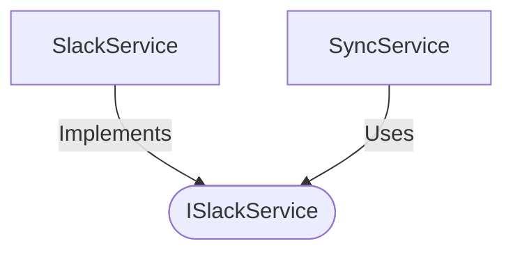

[**spotify-status-bot**](../../../../README.md)

***

[spotify-status-bot](../../../../README.md) / [services/slack/types](../README.md) / ISlackService

# Interface: ISlackService

Defined in: [src/services/slack/types.ts:106](https://github.com/tehJimboJones/spotify-slack-status-sync/blob/1402fbb61b76cfa6bdbfdcbea9a2cb5b97347808/src/services/slack/types.ts#L106)

Interface for Slack API interactions.

## Remarks

Abstracts the Slack bot client, providing methods to send messages, update statuses, and register event/command/view listeners.

### Relationships

```mermaid
graph TD
ISlackService([ISlackService])
SlackService[SlackService] -->|Implements| ISlackService
SyncService[SyncService] -->|Uses| ISlackService
```

## Example

```typescript
await slackService.setStatus('U123', 'Working', ':computer:');
```

## Methods

### clearStatus()

> **clearStatus**(`user`): `Promise`\<`void`\>

Defined in: [src/services/slack/types.ts:114](https://github.com/tehJimboJones/spotify-slack-status-sync/blob/1402fbb61b76cfa6bdbfdcbea9a2cb5b97347808/src/services/slack/types.ts#L114)

#### Parameters

##### user

[`User`](../../../user/types/interfaces/User.md)

#### Returns

`Promise`\<`void`\>

***

### getRouter()

> **getRouter**(): `Router`

Defined in: [src/services/slack/types.ts:115](https://github.com/tehJimboJones/spotify-slack-status-sync/blob/1402fbb61b76cfa6bdbfdcbea9a2cb5b97347808/src/services/slack/types.ts#L115)

#### Returns

`Router`

***

### openSettingsModal()

> **openSettingsModal**(`triggerId`, `userId`, `currentSettings`): `Promise`\<`void`\>

Defined in: [src/services/slack/types.ts:119](https://github.com/tehJimboJones/spotify-slack-status-sync/blob/1402fbb61b76cfa6bdbfdcbea9a2cb5b97347808/src/services/slack/types.ts#L119)

#### Parameters

##### triggerId

`string`

##### userId

`string`

##### currentSettings

`Partial`\<[`User`](../../../user/types/interfaces/User.md)\>

#### Returns

`Promise`\<`void`\>

***

### registerCommandListener()

> **registerCommandListener**(`listener`): `void`

Defined in: [src/services/slack/types.ts:116](https://github.com/tehJimboJones/spotify-slack-status-sync/blob/1402fbb61b76cfa6bdbfdcbea9a2cb5b97347808/src/services/slack/types.ts#L116)

#### Parameters

##### listener

[`ICommandListener`](../../command/types/interfaces/ICommandListener.md)

#### Returns

`void`

***

### registerEventListener()

> **registerEventListener**(`listener`): `void`

Defined in: [src/services/slack/types.ts:118](https://github.com/tehJimboJones/spotify-slack-status-sync/blob/1402fbb61b76cfa6bdbfdcbea9a2cb5b97347808/src/services/slack/types.ts#L118)

#### Parameters

##### listener

[`IEventListener`](IEventListener.md)

#### Returns

`void`

***

### registerViewListener()

> **registerViewListener**(`listener`): `void`

Defined in: [src/services/slack/types.ts:117](https://github.com/tehJimboJones/spotify-slack-status-sync/blob/1402fbb61b76cfa6bdbfdcbea9a2cb5b97347808/src/services/slack/types.ts#L117)

#### Parameters

##### listener

[`IViewListener`](../../view/types/interfaces/IViewListener.md)

#### Returns

`void`

***

### sendMessage()

> **sendMessage**(`channelOrUserId`, `text`, `options?`): `Promise`\<\{ `channel`: `string`; `messageTimestamp`: `string`; \} \| `null`\>

Defined in: [src/services/slack/types.ts:107](https://github.com/tehJimboJones/spotify-slack-status-sync/blob/1402fbb61b76cfa6bdbfdcbea9a2cb5b97347808/src/services/slack/types.ts#L107)

#### Parameters

##### channelOrUserId

`string`

##### text

`string`

##### options?

[`SlackSendMessageOptions`](SlackSendMessageOptions.md)

#### Returns

`Promise`\<\{ `channel`: `string`; `messageTimestamp`: `string`; \} \| `null`\>

***

### setStatus()

> **setStatus**(`user`, `text`, `emoji`): `Promise`\<`void`\>

Defined in: [src/services/slack/types.ts:113](https://github.com/tehJimboJones/spotify-slack-status-sync/blob/1402fbb61b76cfa6bdbfdcbea9a2cb5b97347808/src/services/slack/types.ts#L113)

#### Parameters

##### user

[`User`](../../../user/types/interfaces/User.md)

##### text

`string`

##### emoji

`string`

#### Returns

`Promise`\<`void`\>

***

### updateMessage()

> **updateMessage**(`channel`, `messageTimestamp`, `text`): `Promise`\<`void`\>

Defined in: [src/services/slack/types.ts:112](https://github.com/tehJimboJones/spotify-slack-status-sync/blob/1402fbb61b76cfa6bdbfdcbea9a2cb5b97347808/src/services/slack/types.ts#L112)

#### Parameters

##### channel

`string`

##### messageTimestamp

`string`

##### text

`string`

#### Returns

`Promise`\<`void`\>
