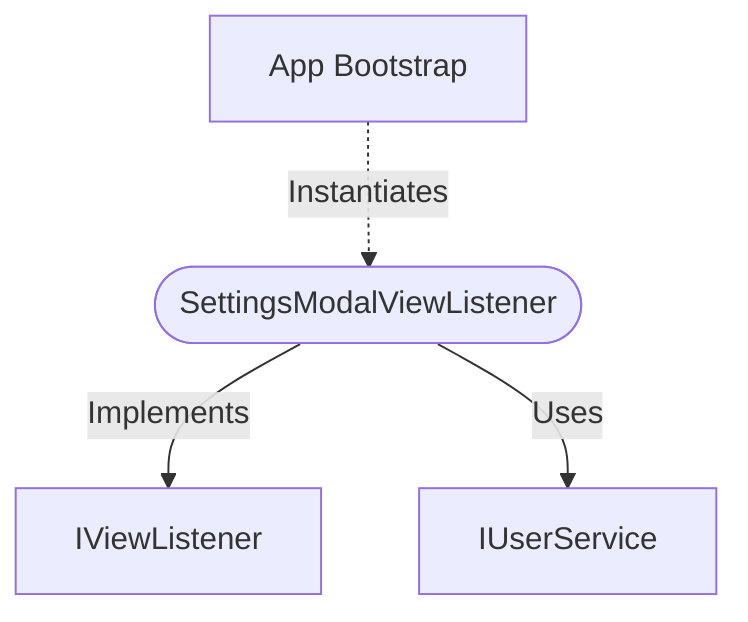

[**spotify-status-bot**](../../../../../README.md)

***

[spotify-status-bot](../../../../../README.md) / [services/slack/view/settings-modal-view-listener.service](../README.md) / SettingsModalViewListener

# Class: SettingsModalViewListener

Defined in: [src/services/slack/view/settings-modal-view-listener.service.ts:45](https://github.com/tehJimboJones/spotify-slack-status-sync/blob/1e46a35f98db5d61d3f91586400e86d860cce2c4/src/services/slack/view/settings-modal-view-listener.service.ts#L45)

Handler for the Slack settings modal submission.

## Remarks

Processes configuration updates (like enabling/disabling sync or podcast tracking) submitted via the bot's interactive settings modal.

### Relationships


## Example

```typescript
const listener = new SettingsModalViewListener(userService);
```

## Implements

- [`IViewListener`](../../types/interfaces/IViewListener.md)

## Constructors

### Constructor

> **new SettingsModalViewListener**(`userService`): `SettingsModalViewListener`

Defined in: [src/services/slack/view/settings-modal-view-listener.service.ts:48](https://github.com/tehJimboJones/spotify-slack-status-sync/blob/1e46a35f98db5d61d3f91586400e86d860cce2c4/src/services/slack/view/settings-modal-view-listener.service.ts#L48)

#### Parameters

##### userService

[`IUserService`](../../../../user/types/interfaces/IUserService.md)

#### Returns

`SettingsModalViewListener`

## Properties

### viewCallbackId

> `readonly` **viewCallbackId**: `"settings_modal"` = `'settings_modal'`

Defined in: [src/services/slack/view/settings-modal-view-listener.service.ts:46](https://github.com/tehJimboJones/spotify-slack-status-sync/blob/1e46a35f98db5d61d3f91586400e86d860cce2c4/src/services/slack/view/settings-modal-view-listener.service.ts#L46)

#### Implementation of

[`IViewListener`](../../types/interfaces/IViewListener.md).[`viewCallbackId`](../../types/interfaces/IViewListener.md#viewcallbackid)

## Methods

### handle()

> **handle**(`context`, `_slackService`): `Promise`\<`void`\>

Defined in: [src/services/slack/view/settings-modal-view-listener.service.ts:51](https://github.com/tehJimboJones/spotify-slack-status-sync/blob/1e46a35f98db5d61d3f91586400e86d860cce2c4/src/services/slack/view/settings-modal-view-listener.service.ts#L51)

#### Parameters

##### context

[`IViewContext`](../../types/interfaces/IViewContext.md)

##### \_slackService

[`ISlackService`](../../../types/interfaces/ISlackService.md)

#### Returns

`Promise`\<`void`\>

#### Implementation of

[`IViewListener`](../../types/interfaces/IViewListener.md).[`handle`](../../types/interfaces/IViewListener.md#handle)
