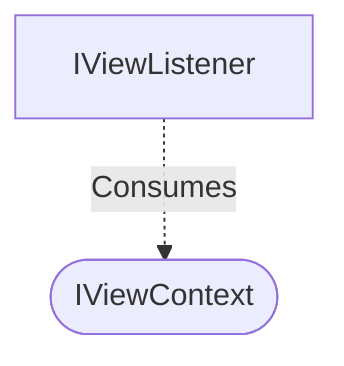

[**spotify-status-bot**](../../../../../README.md)

***

[spotify-status-bot](../../../../../README.md) / [services/slack/view/types](../README.md) / IViewContext

# Interface: IViewContext

Defined in: [src/services/slack/view/types.ts:35](https://github.com/tehJimboJones/spotify-slack-status-sync/blob/1e46a35f98db5d61d3f91586400e86d860cce2c4/src/services/slack/view/types.ts#L35)

Context payload for Slack view submissions.

## Remarks

Encapsulates the data provided by the Slack Bolt API when a user submits a modal view, abstracting away Bolt-specific types.

### Relationships


## Example

```typescript
const ctx: IViewContext = { user: 'U123', view: { state: { values: {} } } };
```

## Properties

### ack

> **ack**: (`response?`) => `Promise`\<`void`\>

Defined in: [src/services/slack/view/types.ts:36](https://github.com/tehJimboJones/spotify-slack-status-sync/blob/1e46a35f98db5d61d3f91586400e86d860cce2c4/src/services/slack/view/types.ts#L36)

#### Parameters

##### response?

[`ViewResponseAction`](../../../types/type-aliases/ViewResponseAction.md)

#### Returns

`Promise`\<`void`\>

***

### body

> **body**: `SlackViewAction`

Defined in: [src/services/slack/view/types.ts:37](https://github.com/tehJimboJones/spotify-slack-status-sync/blob/1e46a35f98db5d61d3f91586400e86d860cce2c4/src/services/slack/view/types.ts#L37)

***

### view

> **view**: `ViewOutput`

Defined in: [src/services/slack/view/types.ts:38](https://github.com/tehJimboJones/spotify-slack-status-sync/blob/1e46a35f98db5d61d3f91586400e86d860cce2c4/src/services/slack/view/types.ts#L38)
