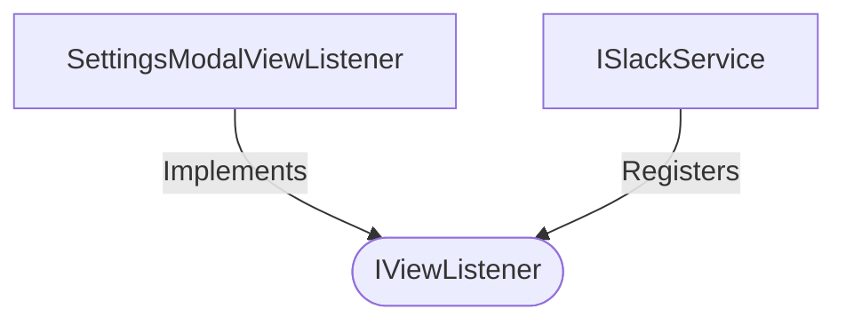

[**spotify-status-bot**](../../../../../README.md)

***

[spotify-status-bot](../../../../../README.md) / [services/slack/view/types](../README.md) / IViewListener

# Interface: IViewListener

Defined in: [src/services/slack/view/types.ts:62](https://github.com/tehJimboJones/spotify-slack-status-sync/blob/1e46a35f98db5d61d3f91586400e86d860cce2c4/src/services/slack/view/types.ts#L62)

Interface for handling Slack view submissions.

## Remarks

Defines a contract for processing modal submissions, allowing the SlackService to dynamically route view events to registered handlers.

### Relationships


## Example

```typescript
slackService.registerViewListener('settings_modal', settingsListener);
```

## Properties

### viewCallbackId

> **viewCallbackId**: `string` \| `RegExp`

Defined in: [src/services/slack/view/types.ts:63](https://github.com/tehJimboJones/spotify-slack-status-sync/blob/1e46a35f98db5d61d3f91586400e86d860cce2c4/src/services/slack/view/types.ts#L63)

## Methods

### handle()

> **handle**(`context`, `slackService`): `Promise`\<`void`\>

Defined in: [src/services/slack/view/types.ts:64](https://github.com/tehJimboJones/spotify-slack-status-sync/blob/1e46a35f98db5d61d3f91586400e86d860cce2c4/src/services/slack/view/types.ts#L64)

#### Parameters

##### context

[`IViewContext`](IViewContext.md)

##### slackService

[`ISlackService`](../../../types/interfaces/ISlackService.md)

#### Returns

`Promise`\<`void`\>
