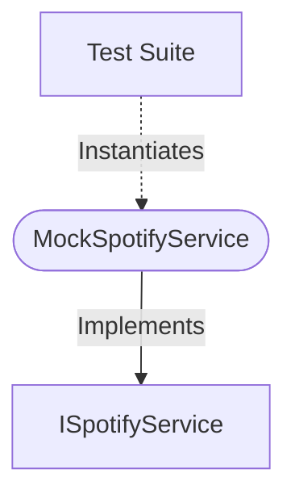

[**spotify-status-bot**](../../../../README.md)

***

[spotify-status-bot](../../../../README.md) / [services/spotify/mock-spotify.service](../README.md) / MockSpotifyService

# Class: MockSpotifyService

Defined in: [src/services/spotify/mock-spotify.service.ts:35](https://github.com/tehJimboJones/spotify-slack-status-sync/blob/1e46a35f98db5d61d3f91586400e86d860cce2c4/src/services/spotify/mock-spotify.service.ts#L35)

Mock implementation of the Spotify service.

## Remarks

Provides predictable, configurable dummy data for Spotify API interactions, enabling deterministic unit testing of dependent services.

### Relationships


## Example

```typescript
const spotifyService = new MockSpotifyService();
```

## Implements

- [`ISpotifyService`](../../types/interfaces/ISpotifyService.md)

## Constructors

### Constructor

> **new MockSpotifyService**(`config?`): `MockSpotifyService`

Defined in: [src/services/spotify/mock-spotify.service.ts:38](https://github.com/tehJimboJones/spotify-slack-status-sync/blob/1e46a35f98db5d61d3f91586400e86d860cce2c4/src/services/spotify/mock-spotify.service.ts#L38)

#### Parameters

##### config?

[`MockSpotifyConfig`](../../types/interfaces/MockSpotifyConfig.md)

#### Returns

`MockSpotifyService`

## Methods

### getCurrentlyPlaying()

> **getCurrentlyPlaying**(`user`): `Promise`\<[`TrackState`](../../types/interfaces/TrackState.md) \| `null`\>

Defined in: [src/services/spotify/mock-spotify.service.ts:42](https://github.com/tehJimboJones/spotify-slack-status-sync/blob/1e46a35f98db5d61d3f91586400e86d860cce2c4/src/services/spotify/mock-spotify.service.ts#L42)

#### Parameters

##### user

[`User`](../../../user/types/interfaces/User.md)

#### Returns

`Promise`\<[`TrackState`](../../types/interfaces/TrackState.md) \| `null`\>

#### Implementation of

[`ISpotifyService`](../../types/interfaces/ISpotifyService.md).[`getCurrentlyPlaying`](../../types/interfaces/ISpotifyService.md#getcurrentlyplaying)

***

### setMockState()

> **setMockState**(`state`): `void`

Defined in: [src/services/spotify/mock-spotify.service.ts:50](https://github.com/tehJimboJones/spotify-slack-status-sync/blob/1e46a35f98db5d61d3f91586400e86d860cce2c4/src/services/spotify/mock-spotify.service.ts#L50)

#### Parameters

##### state

[`TrackState`](../../types/interfaces/TrackState.md) \| `null`

#### Returns

`void`
