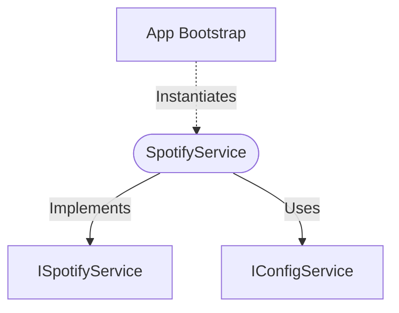

[**spotify-status-bot**](../../../../README.md)

***

[spotify-status-bot](../../../../README.md) / [services/spotify/spotify.service](../README.md) / SpotifyService

# Class: SpotifyService

Defined in: [src/services/spotify/spotify.service.ts:39](https://github.com/tehJimboJones/spotify-slack-status-sync/blob/1e46a35f98db5d61d3f91586400e86d860cce2c4/src/services/spotify/spotify.service.ts#L39)

Concrete implementation of the Spotify API service.

## Remarks

Handles network requests to the Spotify API via Axios, parsing responses into TrackState DTOs and managing OAuth token refreshes.

### Relationships


## Example

```typescript
const spotifyService = new SpotifyService(configService);
```

## Implements

- [`ISpotifyService`](../../types/interfaces/ISpotifyService.md)

## Constructors

### Constructor

> **new SpotifyService**(`configService`): `SpotifyService`

Defined in: [src/services/spotify/spotify.service.ts:43](https://github.com/tehJimboJones/spotify-slack-status-sync/blob/1e46a35f98db5d61d3f91586400e86d860cce2c4/src/services/spotify/spotify.service.ts#L43)

#### Parameters

##### configService

[`IConfigService`](../../../config/types/interfaces/IConfigService.md)

#### Returns

`SpotifyService`

## Methods

### getCurrentlyPlaying()

> **getCurrentlyPlaying**(`user`): `Promise`\<[`TrackState`](../../types/interfaces/TrackState.md) \| `null`\>

Defined in: [src/services/spotify/spotify.service.ts:88](https://github.com/tehJimboJones/spotify-slack-status-sync/blob/1e46a35f98db5d61d3f91586400e86d860cce2c4/src/services/spotify/spotify.service.ts#L88)

#### Parameters

##### user

[`User`](../../../user/types/interfaces/User.md)

#### Returns

`Promise`\<[`TrackState`](../../types/interfaces/TrackState.md) \| `null`\>

#### Implementation of

[`ISpotifyService`](../../types/interfaces/ISpotifyService.md).[`getCurrentlyPlaying`](../../types/interfaces/ISpotifyService.md#getcurrentlyplaying)
