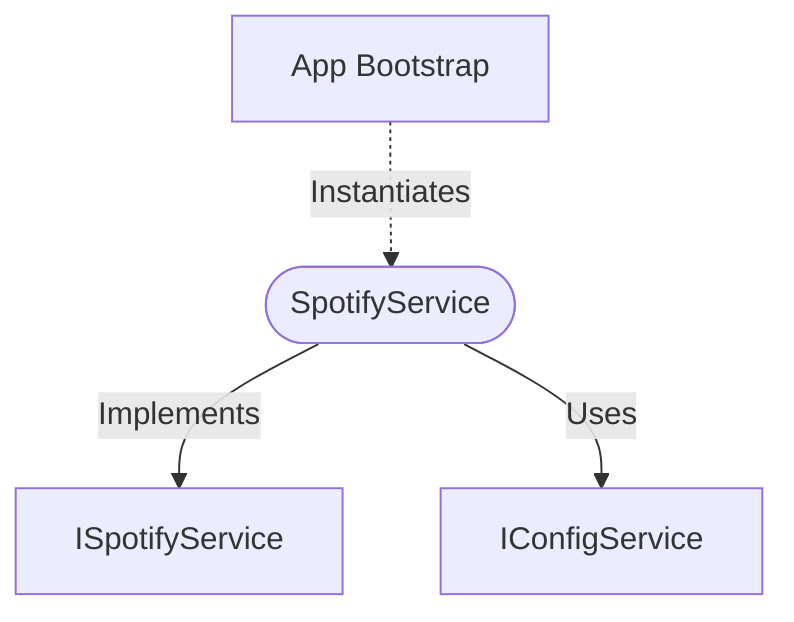

[**spotify-status-bot**](../../../../README.md)

***

[spotify-status-bot](../../../../README.md) / [services/spotify/spotify.service](../README.md) / SpotifyService

# Class: SpotifyService

Defined in: [src/services/spotify/spotify.service.ts:43](https://github.com/tehJimboJones/spotify-slack-status-sync/blob/1402fbb61b76cfa6bdbfdcbea9a2cb5b97347808/src/services/spotify/spotify.service.ts#L43)

Concrete implementation of the Spotify API service.

## Remarks

Handles network requests to the Spotify API via Axios, parsing responses into TrackState DTOs and managing OAuth token refreshes.

### Relationships

```mermaid
graph TD
SpotifyService([SpotifyService]) -->|Implements| ISpotifyService[ISpotifyService]
SpotifyService -->|Uses| IConfigService[IConfigService]
Client[App Bootstrap] -.->|Instantiates| SpotifyService
```

## Example

```typescript
const spotifyService = new SpotifyService(configService);
```

## Implements

- [`ISpotifyService`](../../types/interfaces/ISpotifyService.md)

## Constructors

### Constructor

> **new SpotifyService**(`configService`): `SpotifyService`

Defined in: [src/services/spotify/spotify.service.ts:78](https://github.com/tehJimboJones/spotify-slack-status-sync/blob/1402fbb61b76cfa6bdbfdcbea9a2cb5b97347808/src/services/spotify/spotify.service.ts#L78)

#### Parameters

##### configService

[`IConfigService`](../../../config/types/interfaces/IConfigService.md)

Application configuration provider supplying Spotify API credentials.

#### Returns

`SpotifyService`

## Methods

### getCurrentlyPlaying()

> **getCurrentlyPlaying**(`user`): `Promise`\<[`TrackState`](../../types/interfaces/TrackState.md) \| `null`\>

Defined in: [src/services/spotify/spotify.service.ts:265](https://github.com/tehJimboJones/spotify-slack-status-sync/blob/1402fbb61b76cfa6bdbfdcbea9a2cb5b97347808/src/services/spotify/spotify.service.ts#L265)

Fetches the currently playing track or podcast episode for the given user.

#### Parameters

##### user

[`User`](../../../user/types/interfaces/User.md)

The user whose Spotify playback state should be fetched.

#### Returns

`Promise`\<[`TrackState`](../../types/interfaces/TrackState.md) \| `null`\>

The current [TrackState](../../types/interfaces/TrackState.md), or `null` if nothing is playing.

#### Remarks

Returns `null` when Spotify reports no active playback (HTTP 204 or an empty response).
Throws [SpotifyRateLimitError](../../errors/classes/SpotifyRateLimitError.md) immediately — without making a network request — when
the service is in an active backoff window.  On a live 429 response the backoff window is
updated before throwing.

#### Throws

SpotifyRateLimitError When rate-limited (either backed off or live 429).

#### Throws

SpotifyCurrentlyPlayingError On any other API failure.

#### Implementation of

[`ISpotifyService`](../../types/interfaces/ISpotifyService.md).[`getCurrentlyPlaying`](../../types/interfaces/ISpotifyService.md#getcurrentlyplaying)
