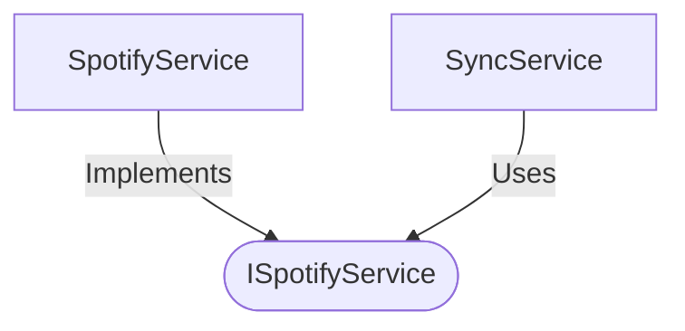

[**spotify-status-bot**](../../../../README.md)

***

[spotify-status-bot](../../../../README.md) / [services/spotify/types](../README.md) / ISpotifyService

# Interface: ISpotifyService

Defined in: [src/services/spotify/types.ts:63](https://github.com/tehJimboJones/spotify-slack-status-sync/blob/1e46a35f98db5d61d3f91586400e86d860cce2c4/src/services/spotify/types.ts#L63)

Interface for Spotify API interactions.

## Remarks

Abstracts the Spotify Web API, defining methods for authentication, token management, and fetching playback state.

### Relationships


## Example

```typescript
const track = await spotifyService.getCurrentlyPlaying(user);
```

## Methods

### getCurrentlyPlaying()

> **getCurrentlyPlaying**(`user`): `Promise`\<[`TrackState`](TrackState.md) \| `null`\>

Defined in: [src/services/spotify/types.ts:64](https://github.com/tehJimboJones/spotify-slack-status-sync/blob/1e46a35f98db5d61d3f91586400e86d860cce2c4/src/services/spotify/types.ts#L64)

#### Parameters

##### user

[`User`](../../../user/types/interfaces/User.md)

#### Returns

`Promise`\<[`TrackState`](TrackState.md) \| `null`\>
