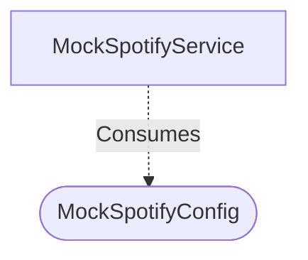

[**spotify-status-bot**](../../../../README.md)

***

[spotify-status-bot](../../../../README.md) / [services/spotify/types](../README.md) / MockSpotifyConfig

# Interface: MockSpotifyConfig

Defined in: [src/services/spotify/types.ts:87](https://github.com/tehJimboJones/spotify-slack-status-sync/blob/1e46a35f98db5d61d3f91586400e86d860cce2c4/src/services/spotify/types.ts#L87)

Configuration options for the MockSpotifyService.

## Remarks

Allows tests to dynamically configure the behavior of the mocked Spotify service, such as simulating playback or forcing errors.

### Relationships


## Example

```typescript
const config: MockSpotifyConfig = { simulateError: true };
```

## Properties

### initialState?

> `optional` **initialState?**: [`TrackState`](TrackState.md) \| `null`

Defined in: [src/services/spotify/types.ts:88](https://github.com/tehJimboJones/spotify-slack-status-sync/blob/1e46a35f98db5d61d3f91586400e86d860cce2c4/src/services/spotify/types.ts#L88)
