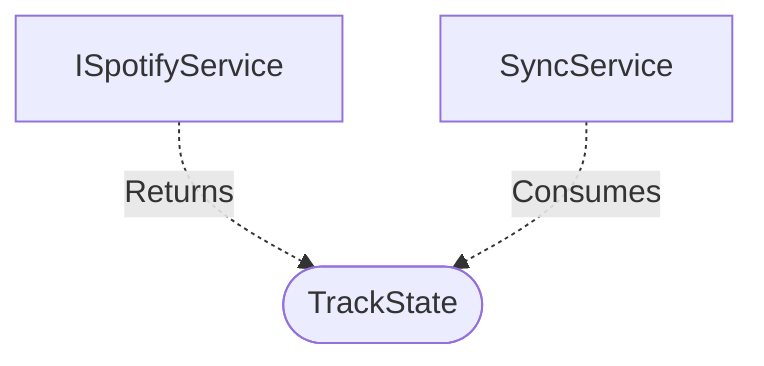

[**spotify-status-bot**](../../../../README.md)

***

[spotify-status-bot](../../../../README.md) / [services/spotify/types](../README.md) / TrackState

# Interface: TrackState

Defined in: [src/services/spotify/types.ts:35](https://github.com/tehJimboJones/spotify-slack-status-sync/blob/1e46a35f98db5d61d3f91586400e86d860cce2c4/src/services/spotify/types.ts#L35)

Represents the current Spotify playback state.

## Remarks

A unified DTO representing either a currently playing music track or a podcast episode, abstracted from raw Spotify API responses.

### Relationships


## Example

```typescript
const state: TrackState = { isPlaying: true, title: 'Song', artist: 'Artist' };
```

## Properties

### artistName?

> `optional` **artistName?**: `string`

Defined in: [src/services/spotify/types.ts:38](https://github.com/tehJimboJones/spotify-slack-status-sync/blob/1e46a35f98db5d61d3f91586400e86d860cce2c4/src/services/spotify/types.ts#L38)

***

### isPlaying

> **isPlaying**: `boolean`

Defined in: [src/services/spotify/types.ts:36](https://github.com/tehJimboJones/spotify-slack-status-sync/blob/1e46a35f98db5d61d3f91586400e86d860cce2c4/src/services/spotify/types.ts#L36)

***

### songName?

> `optional` **songName?**: `string`

Defined in: [src/services/spotify/types.ts:37](https://github.com/tehJimboJones/spotify-slack-status-sync/blob/1e46a35f98db5d61d3f91586400e86d860cce2c4/src/services/spotify/types.ts#L37)

***

### type?

> `optional` **type?**: `"track"` \| `"episode"`

Defined in: [src/services/spotify/types.ts:39](https://github.com/tehJimboJones/spotify-slack-status-sync/blob/1e46a35f98db5d61d3f91586400e86d860cce2c4/src/services/spotify/types.ts#L39)
