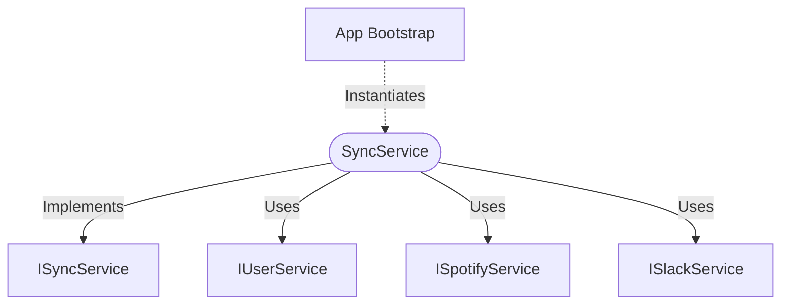

[**spotify-status-bot**](../../../../README.md)

***

[spotify-status-bot](../../../../README.md) / [services/sync/sync.service](../README.md) / SyncService

# Class: SyncService

Defined in: [src/services/sync/sync.service.ts:43](https://github.com/tehJimboJones/spotify-slack-status-sync/blob/1e46a35f98db5d61d3f91586400e86d860cce2c4/src/services/sync/sync.service.ts#L43)

Orchestrates Spotify-to-Slack status synchronization.

## Remarks

Polls the Spotify API for active users and updates their Slack profile status accordingly. Manages its own background loop and error isolation per user.

### Relationships


## Example

```typescript
const syncService = new SyncService(userService, spotifyService, slackService);
```

## Implements

- [`ISyncService`](../../types/interfaces/ISyncService.md)

## Constructors

### Constructor

> **new SyncService**(`spotify`, `slack`, `userService`, `configService`): `SyncService`

Defined in: [src/services/sync/sync.service.ts:48](https://github.com/tehJimboJones/spotify-slack-status-sync/blob/1e46a35f98db5d61d3f91586400e86d860cce2c4/src/services/sync/sync.service.ts#L48)

#### Parameters

##### spotify

[`ISpotifyService`](../../../spotify/types/interfaces/ISpotifyService.md)

##### slack

[`ISlackService`](../../../slack/types/interfaces/ISlackService.md)

##### userService

[`IUserService`](../../../user/types/interfaces/IUserService.md)

##### configService

[`IConfigService`](../../../config/types/interfaces/IConfigService.md)

#### Returns

`SyncService`

## Methods

### start()

> **start**(): `void`

Defined in: [src/services/sync/sync.service.ts:55](https://github.com/tehJimboJones/spotify-slack-status-sync/blob/1e46a35f98db5d61d3f91586400e86d860cce2c4/src/services/sync/sync.service.ts#L55)

#### Returns

`void`

#### Implementation of

[`ISyncService`](../../types/interfaces/ISyncService.md).[`start`](../../types/interfaces/ISyncService.md#start)

***

### stop()

> **stop**(): `void`

Defined in: [src/services/sync/sync.service.ts:66](https://github.com/tehJimboJones/spotify-slack-status-sync/blob/1e46a35f98db5d61d3f91586400e86d860cce2c4/src/services/sync/sync.service.ts#L66)

#### Returns

`void`

#### Implementation of

[`ISyncService`](../../types/interfaces/ISyncService.md).[`stop`](../../types/interfaces/ISyncService.md#stop)

***

### syncNow()

> **syncNow**(): `Promise`\<`void`\>

Defined in: [src/services/sync/sync.service.ts:88](https://github.com/tehJimboJones/spotify-slack-status-sync/blob/1e46a35f98db5d61d3f91586400e86d860cce2c4/src/services/sync/sync.service.ts#L88)

#### Returns

`Promise`\<`void`\>

#### Implementation of

[`ISyncService`](../../types/interfaces/ISyncService.md).[`syncNow`](../../types/interfaces/ISyncService.md#syncnow)
