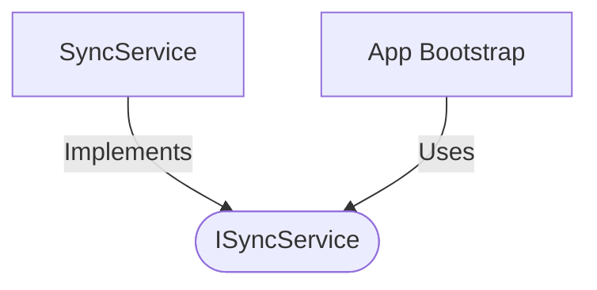

[**spotify-status-bot**](../../../../README.md)

***

[spotify-status-bot](../../../../README.md) / [services/sync/types](../README.md) / ISyncService

# Interface: ISyncService

Defined in: [src/services/sync/types.ts:33](https://github.com/tehJimboJones/spotify-slack-status-sync/blob/1e46a35f98db5d61d3f91586400e86d860cce2c4/src/services/sync/types.ts#L33)

Interface for the status synchronization orchestrator.

## Remarks

Defines the contract for starting and stopping the background process that synchronizes Spotify playback state with Slack profiles.

### Relationships


## Example

```typescript
syncService.startSync();
```

## Methods

### start()

> **start**(): `void`

Defined in: [src/services/sync/types.ts:34](https://github.com/tehJimboJones/spotify-slack-status-sync/blob/1e46a35f98db5d61d3f91586400e86d860cce2c4/src/services/sync/types.ts#L34)

#### Returns

`void`

***

### stop()

> **stop**(): `void`

Defined in: [src/services/sync/types.ts:35](https://github.com/tehJimboJones/spotify-slack-status-sync/blob/1e46a35f98db5d61d3f91586400e86d860cce2c4/src/services/sync/types.ts#L35)

#### Returns

`void`

***

### syncNow()

> **syncNow**(): `Promise`\<`void`\>

Defined in: [src/services/sync/types.ts:36](https://github.com/tehJimboJones/spotify-slack-status-sync/blob/1e46a35f98db5d61d3f91586400e86d860cce2c4/src/services/sync/types.ts#L36)

#### Returns

`Promise`\<`void`\>
