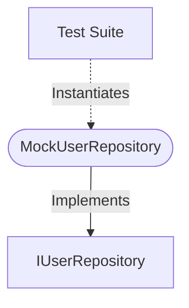

[**spotify-status-bot**](../../../../README.md)

***

[spotify-status-bot](../../../../README.md) / [services/user/mock-user.repository](../README.md) / MockUserRepository

# Class: MockUserRepository

Defined in: [src/services/user/mock-user.repository.ts:35](https://github.com/tehJimboJones/spotify-slack-status-sync/blob/1e46a35f98db5d61d3f91586400e86d860cce2c4/src/services/user/mock-user.repository.ts#L35)

In-memory mock of the User repository.

## Remarks

Provides a stubbed, ephemeral data access layer for User entities to facilitate isolated unit testing of services depending on IUserRepository.

### Relationships


## Example

```typescript
const repo = new MockUserRepository();
```

## Implements

- [`IUserRepository`](../../types/interfaces/IUserRepository.md)

## Constructors

### Constructor

> **new MockUserRepository**(`configService`): `MockUserRepository`

Defined in: [src/services/user/mock-user.repository.ts:38](https://github.com/tehJimboJones/spotify-slack-status-sync/blob/1e46a35f98db5d61d3f91586400e86d860cce2c4/src/services/user/mock-user.repository.ts#L38)

#### Parameters

##### configService

[`IConfigService`](../../../config/types/interfaces/IConfigService.md)

#### Returns

`MockUserRepository`

## Methods

### create()

> **create**(`user`): `Promise`\<[`User`](../../types/interfaces/User.md)\>

Defined in: [src/services/user/mock-user.repository.ts:74](https://github.com/tehJimboJones/spotify-slack-status-sync/blob/1e46a35f98db5d61d3f91586400e86d860cce2c4/src/services/user/mock-user.repository.ts#L74)

#### Parameters

##### user

`Omit`\<[`User`](../../types/interfaces/User.md), `"id"`\>

#### Returns

`Promise`\<[`User`](../../types/interfaces/User.md)\>

#### Implementation of

[`IUserRepository`](../../types/interfaces/IUserRepository.md).[`create`](../../types/interfaces/IUserRepository.md#create)

***

### findAll()

> **findAll**(): `Promise`\<[`User`](../../types/interfaces/User.md)[]\>

Defined in: [src/services/user/mock-user.repository.ts:70](https://github.com/tehJimboJones/spotify-slack-status-sync/blob/1e46a35f98db5d61d3f91586400e86d860cce2c4/src/services/user/mock-user.repository.ts#L70)

#### Returns

`Promise`\<[`User`](../../types/interfaces/User.md)[]\>

#### Implementation of

[`IUserRepository`](../../types/interfaces/IUserRepository.md).[`findAll`](../../types/interfaces/IUserRepository.md#findall)

***

### findById()

> **findById**(`id`): `Promise`\<[`User`](../../types/interfaces/User.md) \| `null`\>

Defined in: [src/services/user/mock-user.repository.ts:55](https://github.com/tehJimboJones/spotify-slack-status-sync/blob/1e46a35f98db5d61d3f91586400e86d860cce2c4/src/services/user/mock-user.repository.ts#L55)

#### Parameters

##### id

`string`

#### Returns

`Promise`\<[`User`](../../types/interfaces/User.md) \| `null`\>

#### Implementation of

[`IUserRepository`](../../types/interfaces/IUserRepository.md).[`findById`](../../types/interfaces/IUserRepository.md#findbyid)

***

### findBySlackId()

> **findBySlackId**(`slackId`): `Promise`\<[`User`](../../types/interfaces/User.md) \| `null`\>

Defined in: [src/services/user/mock-user.repository.ts:59](https://github.com/tehJimboJones/spotify-slack-status-sync/blob/1e46a35f98db5d61d3f91586400e86d860cce2c4/src/services/user/mock-user.repository.ts#L59)

#### Parameters

##### slackId

`string`

#### Returns

`Promise`\<[`User`](../../types/interfaces/User.md) \| `null`\>

#### Implementation of

[`IUserRepository`](../../types/interfaces/IUserRepository.md).[`findBySlackId`](../../types/interfaces/IUserRepository.md#findbyslackid)

***

### update()

> **update**(`slackId`, `data`): `Promise`\<`void`\>

Defined in: [src/services/user/mock-user.repository.ts:63](https://github.com/tehJimboJones/spotify-slack-status-sync/blob/1e46a35f98db5d61d3f91586400e86d860cce2c4/src/services/user/mock-user.repository.ts#L63)

#### Parameters

##### slackId

`string`

##### data

`Partial`\<[`User`](../../types/interfaces/User.md)\>

#### Returns

`Promise`\<`void`\>

#### Implementation of

[`IUserRepository`](../../types/interfaces/IUserRepository.md).[`update`](../../types/interfaces/IUserRepository.md#update)
