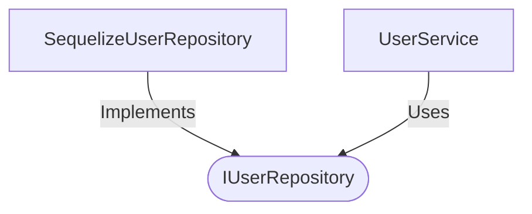

[**spotify-status-bot**](../../../../README.md)

***

[spotify-status-bot](../../../../README.md) / [services/user/types](../README.md) / IUserRepository

# Interface: IUserRepository

Defined in: [src/services/user/types.ts:69](https://github.com/tehJimboJones/spotify-slack-status-sync/blob/1e46a35f98db5d61d3f91586400e86d860cce2c4/src/services/user/types.ts#L69)

Data access interface for User entities.

## Remarks

Abstracts the underlying database operations (e.g., Sequelize) for managing User records, allowing for dependency injection and mock implementations.

### Relationships


## Example

```typescript
const user = await userRepository.findBySlackId('U123');
```

## Methods

### create()

> **create**(`user`): `Promise`\<[`User`](User.md)\>

Defined in: [src/services/user/types.ts:74](https://github.com/tehJimboJones/spotify-slack-status-sync/blob/1e46a35f98db5d61d3f91586400e86d860cce2c4/src/services/user/types.ts#L74)

#### Parameters

##### user

`Omit`\<[`User`](User.md), `"id"`\>

#### Returns

`Promise`\<[`User`](User.md)\>

***

### findAll()

> **findAll**(): `Promise`\<[`User`](User.md)[]\>

Defined in: [src/services/user/types.ts:73](https://github.com/tehJimboJones/spotify-slack-status-sync/blob/1e46a35f98db5d61d3f91586400e86d860cce2c4/src/services/user/types.ts#L73)

#### Returns

`Promise`\<[`User`](User.md)[]\>

***

### findById()

> **findById**(`id`): `Promise`\<[`User`](User.md) \| `null`\>

Defined in: [src/services/user/types.ts:70](https://github.com/tehJimboJones/spotify-slack-status-sync/blob/1e46a35f98db5d61d3f91586400e86d860cce2c4/src/services/user/types.ts#L70)

#### Parameters

##### id

`string`

#### Returns

`Promise`\<[`User`](User.md) \| `null`\>

***

### findBySlackId()

> **findBySlackId**(`slackId`): `Promise`\<[`User`](User.md) \| `null`\>

Defined in: [src/services/user/types.ts:71](https://github.com/tehJimboJones/spotify-slack-status-sync/blob/1e46a35f98db5d61d3f91586400e86d860cce2c4/src/services/user/types.ts#L71)

#### Parameters

##### slackId

`string`

#### Returns

`Promise`\<[`User`](User.md) \| `null`\>

***

### update()

> **update**(`slackId`, `data`): `Promise`\<`void`\>

Defined in: [src/services/user/types.ts:72](https://github.com/tehJimboJones/spotify-slack-status-sync/blob/1e46a35f98db5d61d3f91586400e86d860cce2c4/src/services/user/types.ts#L72)

#### Parameters

##### slackId

`string`

##### data

`Partial`\<[`User`](User.md)\>

#### Returns

`Promise`\<`void`\>
