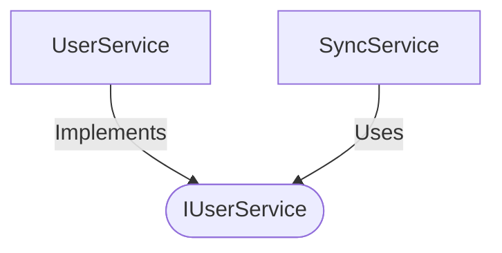

[**spotify-status-bot**](../../../../README.md)

***

[spotify-status-bot](../../../../README.md) / [services/user/types](../README.md) / IUserService

# Interface: IUserService

Defined in: [src/services/user/types.ts:98](https://github.com/tehJimboJones/spotify-slack-status-sync/blob/1e46a35f98db5d61d3f91586400e86d860cce2c4/src/services/user/types.ts#L98)

Business logic interface for user management.

## Remarks

Defines the contract for user-related operations, decoupling dependent services (like Sync or Slack command listeners) from the concrete UserService implementation.

### Relationships


## Example

```typescript
await userService.updateUserSyncPreference('U123', true);
```

## Methods

### getActiveUsers()

> **getActiveUsers**(): `Promise`\<[`User`](User.md)[]\>

Defined in: [src/services/user/types.ts:100](https://github.com/tehJimboJones/spotify-slack-status-sync/blob/1e46a35f98db5d61d3f91586400e86d860cce2c4/src/services/user/types.ts#L100)

#### Returns

`Promise`\<[`User`](User.md)[]\>

***

### getUser()

> **getUser**(`slackId`): `Promise`\<[`User`](User.md)\>

Defined in: [src/services/user/types.ts:99](https://github.com/tehJimboJones/spotify-slack-status-sync/blob/1e46a35f98db5d61d3f91586400e86d860cce2c4/src/services/user/types.ts#L99)

#### Parameters

##### slackId

`string`

#### Returns

`Promise`\<[`User`](User.md)\>

***

### toggleUserSync()

> **toggleUserSync**(`slackId`, `isSyncActive`): `Promise`\<`void`\>

Defined in: [src/services/user/types.ts:101](https://github.com/tehJimboJones/spotify-slack-status-sync/blob/1e46a35f98db5d61d3f91586400e86d860cce2c4/src/services/user/types.ts#L101)

#### Parameters

##### slackId

`string`

##### isSyncActive

`boolean`

#### Returns

`Promise`\<`void`\>

***

### upsertUser()

> **upsertUser**(`slackId`, `data`): `Promise`\<`void`\>

Defined in: [src/services/user/types.ts:102](https://github.com/tehJimboJones/spotify-slack-status-sync/blob/1e46a35f98db5d61d3f91586400e86d860cce2c4/src/services/user/types.ts#L102)

#### Parameters

##### slackId

`string`

##### data

`Partial`\<[`User`](User.md)\>

#### Returns

`Promise`\<`void`\>
