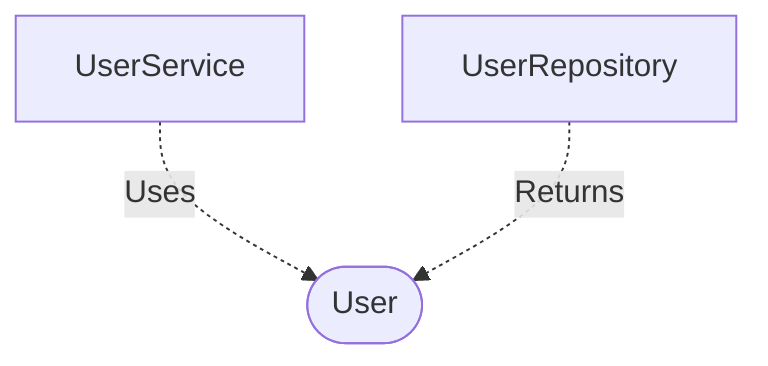

[**spotify-status-bot**](../../../../README.md)

***

[spotify-status-bot](../../../../README.md) / [services/user/types](../README.md) / User

# Interface: User

Defined in: [src/services/user/types.ts:33](https://github.com/tehJimboJones/spotify-slack-status-sync/blob/1e46a35f98db5d61d3f91586400e86d860cce2c4/src/services/user/types.ts#L33)

Domain model interface for a User.

## Remarks

Represents the core User entity in the application, storing Slack identifiers, Spotify tokens, and configuration preferences for status syncing.

### Relationships


## Example

```typescript
const user: User = { slackId: 'U123', isSyncEnabled: true };
```

## Properties

### id

> **id**: `string`

Defined in: [src/services/user/types.ts:34](https://github.com/tehJimboJones/spotify-slack-status-sync/blob/1e46a35f98db5d61d3f91586400e86d860cce2c4/src/services/user/types.ts#L34)

***

### isSyncActive

> **isSyncActive**: `boolean`

Defined in: [src/services/user/types.ts:38](https://github.com/tehJimboJones/spotify-slack-status-sync/blob/1e46a35f98db5d61d3f91586400e86d860cce2c4/src/services/user/types.ts#L38)

***

### pausedEmoji

> **pausedEmoji**: `string`

Defined in: [src/services/user/types.ts:41](https://github.com/tehJimboJones/spotify-slack-status-sync/blob/1e46a35f98db5d61d3f91586400e86d860cce2c4/src/services/user/types.ts#L41)

***

### podcastPausedEmoji

> **podcastPausedEmoji**: `string`

Defined in: [src/services/user/types.ts:45](https://github.com/tehJimboJones/spotify-slack-status-sync/blob/1e46a35f98db5d61d3f91586400e86d860cce2c4/src/services/user/types.ts#L45)

***

### podcastStatusEmoji

> **podcastStatusEmoji**: `string`

Defined in: [src/services/user/types.ts:44](https://github.com/tehJimboJones/spotify-slack-status-sync/blob/1e46a35f98db5d61d3f91586400e86d860cce2c4/src/services/user/types.ts#L44)

***

### podcastStatusFormat

> **podcastStatusFormat**: `string`

Defined in: [src/services/user/types.ts:43](https://github.com/tehJimboJones/spotify-slack-status-sync/blob/1e46a35f98db5d61d3f91586400e86d860cce2c4/src/services/user/types.ts#L43)

***

### slackUserId

> **slackUserId**: `string`

Defined in: [src/services/user/types.ts:35](https://github.com/tehJimboJones/spotify-slack-status-sync/blob/1e46a35f98db5d61d3f91586400e86d860cce2c4/src/services/user/types.ts#L35)

***

### slackUserToken

> **slackUserToken**: `string`

Defined in: [src/services/user/types.ts:36](https://github.com/tehJimboJones/spotify-slack-status-sync/blob/1e46a35f98db5d61d3f91586400e86d860cce2c4/src/services/user/types.ts#L36)

***

### spotifyRefreshToken

> **spotifyRefreshToken**: `string`

Defined in: [src/services/user/types.ts:37](https://github.com/tehJimboJones/spotify-slack-status-sync/blob/1e46a35f98db5d61d3f91586400e86d860cce2c4/src/services/user/types.ts#L37)

***

### statusEmoji

> **statusEmoji**: `string`

Defined in: [src/services/user/types.ts:40](https://github.com/tehJimboJones/spotify-slack-status-sync/blob/1e46a35f98db5d61d3f91586400e86d860cce2c4/src/services/user/types.ts#L40)

***

### statusFormat

> **statusFormat**: `string`

Defined in: [src/services/user/types.ts:39](https://github.com/tehJimboJones/spotify-slack-status-sync/blob/1e46a35f98db5d61d3f91586400e86d860cce2c4/src/services/user/types.ts#L39)

***

### syncPodcasts

> **syncPodcasts**: `boolean`

Defined in: [src/services/user/types.ts:42](https://github.com/tehJimboJones/spotify-slack-status-sync/blob/1e46a35f98db5d61d3f91586400e86d860cce2c4/src/services/user/types.ts#L42)
