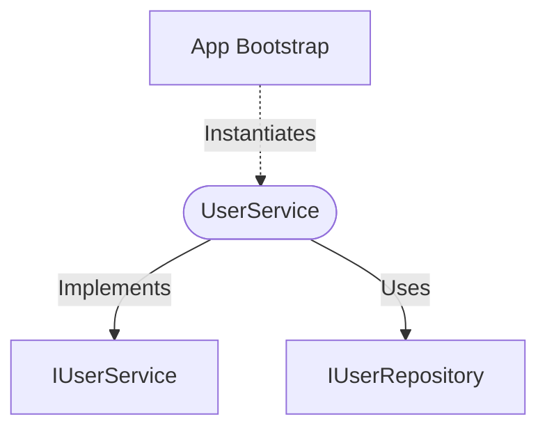

[**spotify-status-bot**](../../../../README.md)

***

[spotify-status-bot](../../../../README.md) / [services/user/user.service](../README.md) / UserService

# Class: UserService

Defined in: [src/services/user/user.service.ts:36](https://github.com/tehJimboJones/spotify-slack-status-sync/blob/1e46a35f98db5d61d3f91586400e86d860cce2c4/src/services/user/user.service.ts#L36)

Core service for managing user entities.

## Remarks

Encapsulates business logic for user operations, bridging the Slack and Spotify integrations by managing user preferences, tokens, and database persistence.

### Relationships


## Example

```typescript
const userService = new UserService(userRepository);
```

## Implements

- [`IUserService`](../../types/interfaces/IUserService.md)

## Constructors

### Constructor

> **new UserService**(`userRepository`): `UserService`

Defined in: [src/services/user/user.service.ts:37](https://github.com/tehJimboJones/spotify-slack-status-sync/blob/1e46a35f98db5d61d3f91586400e86d860cce2c4/src/services/user/user.service.ts#L37)

#### Parameters

##### userRepository

[`IUserRepository`](../../types/interfaces/IUserRepository.md)

#### Returns

`UserService`

## Methods

### getActiveUsers()

> **getActiveUsers**(): `Promise`\<[`User`](../../types/interfaces/User.md)[]\>

Defined in: [src/services/user/user.service.ts:47](https://github.com/tehJimboJones/spotify-slack-status-sync/blob/1e46a35f98db5d61d3f91586400e86d860cce2c4/src/services/user/user.service.ts#L47)

#### Returns

`Promise`\<[`User`](../../types/interfaces/User.md)[]\>

#### Implementation of

[`IUserService`](../../types/interfaces/IUserService.md).[`getActiveUsers`](../../types/interfaces/IUserService.md#getactiveusers)

***

### getUser()

> **getUser**(`slackId`): `Promise`\<[`User`](../../types/interfaces/User.md)\>

Defined in: [src/services/user/user.service.ts:39](https://github.com/tehJimboJones/spotify-slack-status-sync/blob/1e46a35f98db5d61d3f91586400e86d860cce2c4/src/services/user/user.service.ts#L39)

#### Parameters

##### slackId

`string`

#### Returns

`Promise`\<[`User`](../../types/interfaces/User.md)\>

#### Implementation of

[`IUserService`](../../types/interfaces/IUserService.md).[`getUser`](../../types/interfaces/IUserService.md#getuser)

***

### toggleUserSync()

> **toggleUserSync**(`slackId`, `isSyncActive`): `Promise`\<`void`\>

Defined in: [src/services/user/user.service.ts:52](https://github.com/tehJimboJones/spotify-slack-status-sync/blob/1e46a35f98db5d61d3f91586400e86d860cce2c4/src/services/user/user.service.ts#L52)

#### Parameters

##### slackId

`string`

##### isSyncActive

`boolean`

#### Returns

`Promise`\<`void`\>

#### Implementation of

[`IUserService`](../../types/interfaces/IUserService.md).[`toggleUserSync`](../../types/interfaces/IUserService.md#toggleusersync)

***

### upsertUser()

> **upsertUser**(`slackId`, `data`): `Promise`\<`void`\>

Defined in: [src/services/user/user.service.ts:61](https://github.com/tehJimboJones/spotify-slack-status-sync/blob/1e46a35f98db5d61d3f91586400e86d860cce2c4/src/services/user/user.service.ts#L61)

#### Parameters

##### slackId

`string`

##### data

`Partial`\<[`User`](../../types/interfaces/User.md)\>

#### Returns

`Promise`\<`void`\>

#### Implementation of

[`IUserService`](../../types/interfaces/IUserService.md).[`upsertUser`](../../types/interfaces/IUserService.md#upsertuser)
