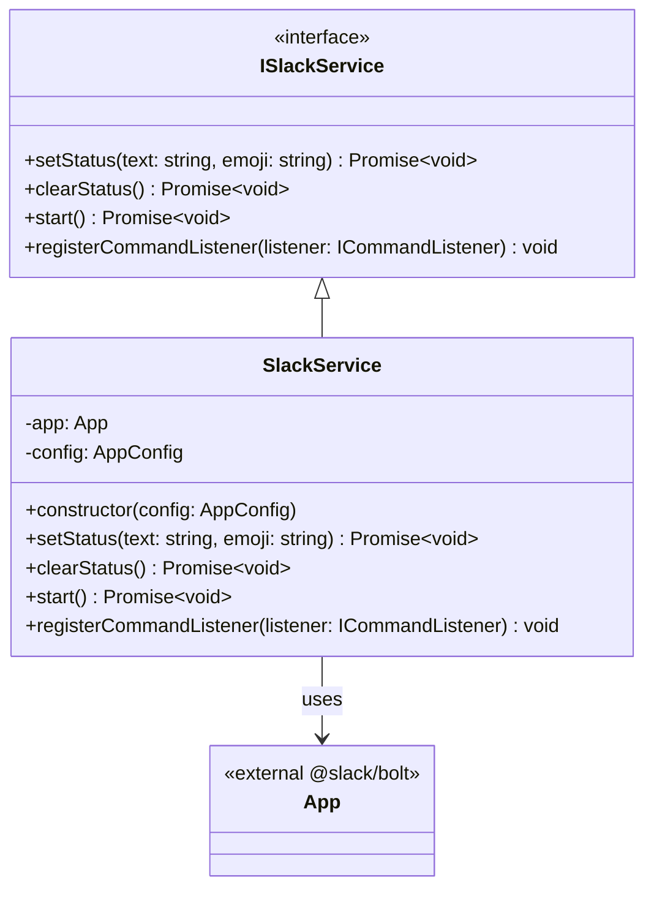

# Slack Service

## Purpose and Functionality
The Slack Service is responsible for all interactions with the Slack API. Its primary functionality is to authenticate with Slack, update the user's profile status text and emoji, clear the status when playback stops, and start the Slack Bolt app to listen for incoming Slack commands.

## Class Diagram

## Interactions
- **Config**: Consumes `AppConfig` to configure the `@slack/bolt` App instance with tokens and secrets.
- **SyncService**: Called by the `SyncService` to `setStatus` or `clearStatus` based on the Spotify playback state.
- **CommandListenerService**: Registers `ICommandListener` objects to handle incoming Slash commands from the Slack UI.
