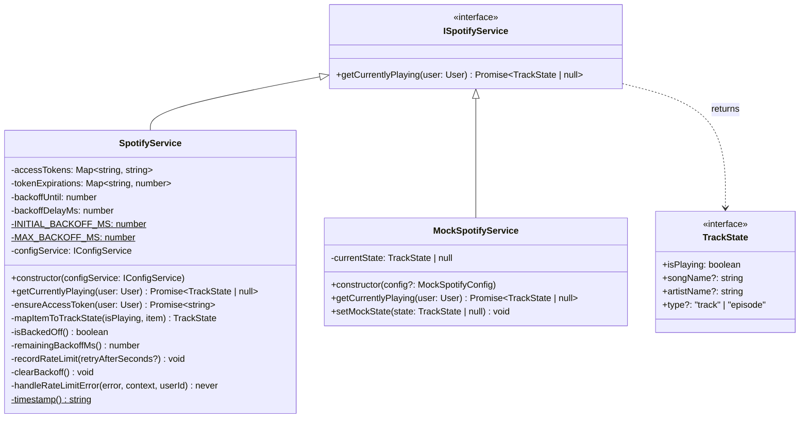

# Spotify Service

## Purpose and Functionality

The Spotify Service is the integration layer with the Spotify Web API. It is responsible for:

- Fetching the currently playing track or podcast episode for a given user.
- Managing per-user OAuth access tokens — transparently refreshing them via the refresh-token grant when they are absent or nearing expiry.
- Applying a **global exponential backoff** when Spotify returns HTTP 429 responses, preventing the app from re-hitting the API while rate-limited.

## Class Diagram



## Token Management

Access tokens are cached per user in `accessTokens` / `tokenExpirations` maps. Before every API call, `ensureAccessToken()` checks whether the cached token has more than 60 seconds of remaining validity. If not, it performs a refresh-token grant against `https://accounts.spotify.com/api/token`.

A successful refresh clears the global backoff state. A 429 on the token endpoint triggers the same backoff path as a 429 on the playback endpoint.

## Exponential Backoff

The backoff state is **global** — shared across all users — because all users share the same Spotify API client credentials (Client ID / Client Secret).

| Field | Description |
|---|---|
| `backoffUntil` | Epoch ms at which the backoff window expires (0 = not backed off) |
| `backoffDelayMs` | Delay to use for the *next* backoff window (doubles each 429) |
| `INITIAL_BACKOFF_MS` | 1 000 ms |
| `MAX_BACKOFF_MS` | 300 000 ms (5 minutes) |

When a 429 is received:

1. `recordRateLimit()` doubles `backoffDelayMs` (capped at `MAX_BACKOFF_MS`) and applies ±10 % jitter.
2. If a `Retry-After` header is present its value is used directly instead.
3. `handleRateLimitError()` logs the event and throws `SpotifyRateLimitError` with `retryAfterMs` set to the remaining window.

On any successful response, `clearBackoff()` resets both fields.

Both `getCurrentlyPlaying()` and `ensureAccessToken()` **check the backoff state at entry** and throw `SpotifyRateLimitError` immediately — without making a network request — if the window has not yet expired.

## `getCurrentlyPlaying` Flow

```
getCurrentlyPlaying(user)
  ├─ isBackedOff()?  → throw SpotifyRateLimitError
  ├─ ensureAccessToken(user)
  │    ├─ isBackedOff()?  → throw SpotifyRateLimitError
  │    ├─ cached token valid?  → return token
  │    └─ POST /api/token
  │         ├─ 429  → handleRateLimitError → throw SpotifyRateLimitError
  │         └─ error → throw SpotifyTokenRefreshError
  ├─ GET /v1/me/player/currently-playing
  │    ├─ 204 / no item  → return null
  │    ├─ 429  → handleRateLimitError → throw SpotifyRateLimitError
  │    └─ error → throw SpotifyCurrentlyPlayingError
  ├─ mapItemToTrackState()
  ├─ clearBackoff()
  └─ return TrackState
```

## Errors

| Class | Code | When thrown |
|---|---|---|
| `SpotifyTokenRefreshError` | `SPOTIFY_TOKEN_REFRESH_ERROR` | Non-429 failure refreshing the OAuth access token |
| `SpotifyCurrentlyPlayingError` | `SPOTIFY_CURRENTLY_PLAYING_ERROR` | Non-429 failure fetching playback state |
| `SpotifyRateLimitError` | `SPOTIFY_RATE_LIMIT_ERROR` | Service is backed off, or a live 429 was received; carries `retryAfterMs` |

## Interactions

| Dependency | Interface | Usage |
|---|---|---|
| **ConfigService** | `IConfigService` | Provides Spotify Client ID and Client Secret for token refresh |
| **SyncService** | `ISpotifyService` consumer | Calls `getCurrentlyPlaying(user)` each poll cycle |
| **Spotify Accounts API** | — | `POST https://accounts.spotify.com/api/token` for token refresh |
| **Spotify Web API** | — | `GET https://api.spotify.com/v1/me/player/currently-playing` for playback state |
