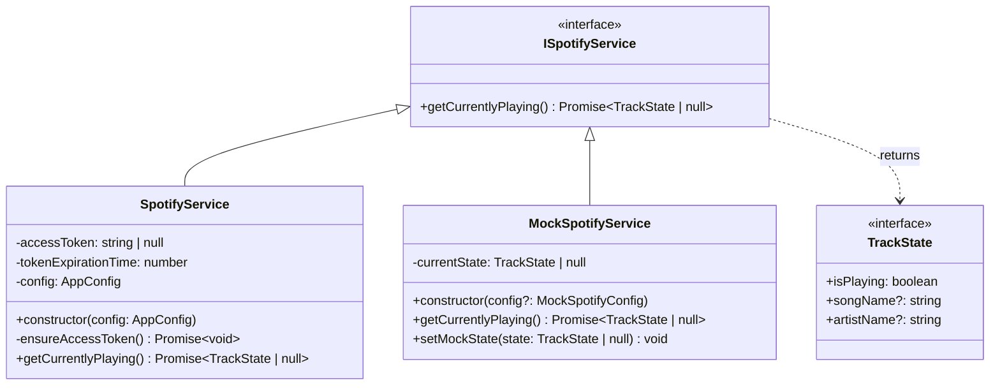

# Spotify Service

## Purpose and Functionality
The Spotify Service acts as an integration layer with the real Spotify API via OAuth 2.0. It fetches the user's currently playing track or episode. The service manages authentication by seamlessly refreshing the OAuth access token using a refresh token when necessary.

## Class Diagram

## Interactions
- **Config**: Consumes `AppConfig` to obtain Spotify API credentials (Client ID, Client Secret, Refresh Token).
- **SyncService**: Polled by the `SyncService` via `getCurrentlyPlaying()` to detect state changes and update Slack accordingly.
