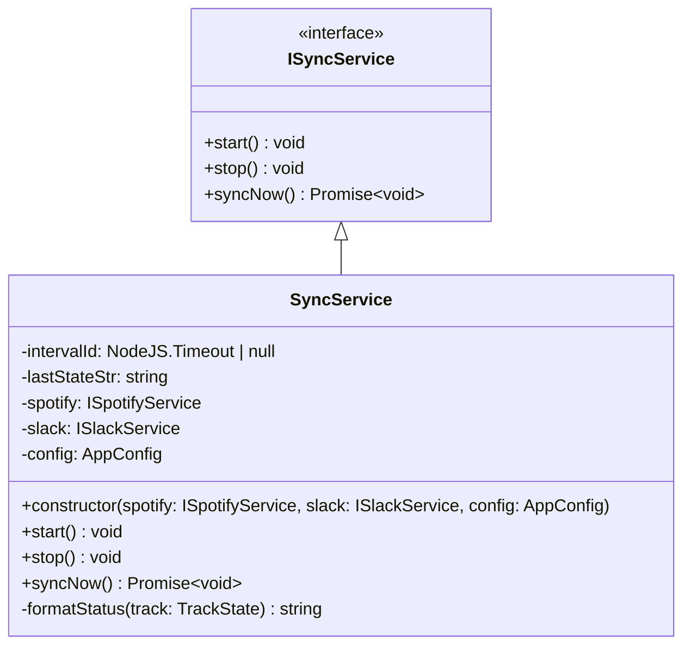

# Sync Service

## Purpose and Functionality
The Sync Service is the core orchestrator of the bot. It runs a polling loop at a configured interval to repeatedly check the current playback state from the Spotify Service and synchronize it with the Slack Service. It caches the previous state to avoid making unnecessary redundant API calls to Slack.

## Class Diagram

## Interactions
- **SpotifyService**: Uses `ISpotifyService` to retrieve the currently playing track.
- **SlackService**: Uses `ISlackService` to set or clear the user's status profile.
- **Config**: Consumes `AppConfig` for formatting options (`statusFormat`, `statusEmoji`, `pausedEmoji`) and the polling interval (`pollIntervalMs`).
- **CommandListenerService**: Can be instructed to `start()` or `stop()` the polling loop based on Slack slash commands.
