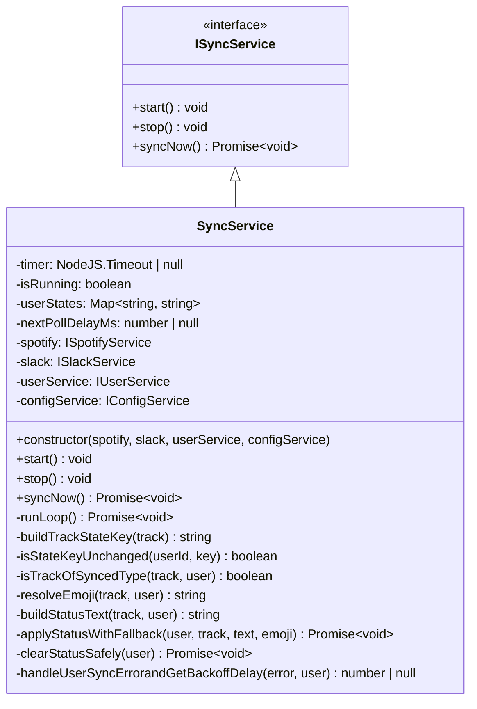

# Sync Service

## Purpose and Functionality

The Sync Service is the core orchestrator of the bot. It runs a polling loop at a configured interval, fetching each active user's current Spotify playback state and synchronising it with their Slack profile status. A per-user state cache prevents unnecessary Slack API calls when nothing has changed.

The service also honours Spotify rate-limit responses: when a `SpotifyRateLimitError` is received, the next polling interval is automatically extended to match the backoff window returned by the Spotify service, then returns to the standard interval on the following cycle.

## Class Diagram



## Polling Loop

`start()` kicks off `runLoop()`, which calls `syncNow()` then re-schedules itself. The delay used for re-scheduling is normally `pollIntervalMs` from config, but will be the value from a `SpotifyRateLimitError` if one was received during the last `syncNow()` pass. The override is consumed once and the service returns to the standard interval on the next cycle.

```
start()
  └─ runLoop()  ◄─────────────────────────────────┐
       ├─ syncNow()                                │
       │    └─ for each active user:               │
       │         ├─ getCurrentlyPlaying()          │
       │         ├─ buildTrackStateKey()           │
       │         ├─ [skip if state unchanged]      │
       │         ├─ isTrackOfSyncedType()?         │
       │         │    ├─ yes → applyStatusWithFallback()
       │         │    └─ no  → clearStatusSafely()
       │         └─ [catch] handleUserSyncError…() │
       └─ setTimeout(pollIntervalMs | backoffMs) ──┘
```

## Per-User State Change Detection

`buildTrackStateKey()` encodes the playback state into a colon-delimited string:

```
playing:track:Song Title:Artist Name
paused:episode:Episode Title:Podcast Name
(empty string when nothing is playing)
```

`isStateKeyUnchanged()` compares the fresh key against the cached value in `userStates`. If they match the user is skipped for that cycle, avoiding a Slack API call.

## Status Text & Emoji Resolution

`buildStatusText()` selects the user's configured format string (`statusFormat` / `podcastStatusFormat`) and substitutes tokens:

| Media type | Tokens replaced |
|---|---|
| Track | `{song}`, `{artist}` |
| Episode | `{podcast name}`, `{episode title}` |

`resolveEmoji()` picks from the user's four emoji preferences based on media type and play/pause state:

| State | Track emoji | Episode emoji |
|---|---|---|
| Playing | `statusEmoji` | `podcastStatusEmoji` |
| Paused | `pausedEmoji` | `podcastPausedEmoji` |

## Slack Status Update with Fallback

`applyStatusWithFallback()` attempts `slack.setStatus()` with the user-configured emoji. If a `SlackStatusSetError` is thrown (e.g. the custom emoji is not available in the workspace), it falls back to a built-in system emoji (`:musical_note:` / `:double_vertical_bar:` for tracks; `:microphone:` / `:double_vertical_bar:` for episodes) and retries once. Any further failure is logged and swallowed so the rest of the sync loop is unaffected.

## Rate-Limit Backoff

When `SpotifyService` returns a `SpotifyRateLimitError`, `handleUserSyncErrorandGetBackoffDelay()` logs a warning and returns `error.retryAfterMs`. The caller sets `nextPollDelayMs` to this value; `runLoop()` reads and clears it when scheduling the next tick. Subsequent cycles return to `pollIntervalMs` automatically.

If multiple users trigger a rate-limit error in the same `syncNow()` pass, the last received value wins (last-write-wins), which is intentional — all errors share the same global Spotify API backoff window.

## Interactions

| Dependency | Interface | Usage |
|---|---|---|
| **SpotifyService** | `ISpotifyService` | Fetches the currently playing track/episode per user |
| **SlackService** | `ISlackService` | Sets or clears each user's Slack profile status |
| **UserService** | `IUserService` | Retrieves the list of active users each poll cycle |
| **ConfigService** | `IConfigService` | Provides `pollIntervalMs` and fallback emoji configuration |
| **CommandListenerService** | — | Calls `start()` / `stop()` in response to Slack slash commands |
